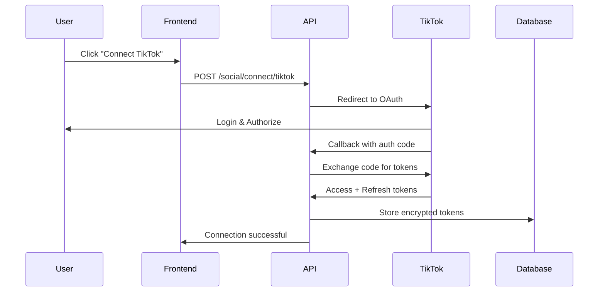
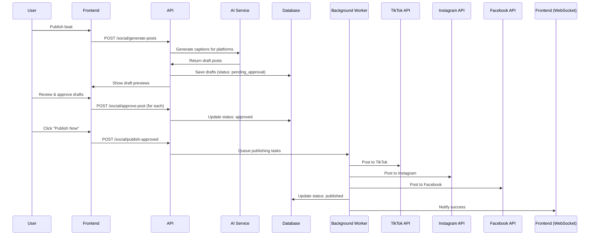

# Design Document - AI Promotion Platform

## Overview

This document defines the technical architecture, system design, data models, API specifications, and UI components for the AI Promotion Platform. The design prioritizes real-time performance, autonomous AI operations, multi-platform integration, and mobile-first African market optimization.

## System Architecture

### High-Level Architecture

```
┌─────────────────────────────────────────────────────────────────┐
│                         Frontend (Next.js PWA)                   │
│  ┌──────────────┐  ┌──────────────┐  ┌──────────────┐         │
│  │  AI Chat UI  │  │  Campaign    │  │  Analytics   │         │
│  │              │  │  Dashboard   │  │  Dashboard   │         │
│  └──────────────┘  └──────────────┘  └──────────────┘         │
└────────────────────────────┬────────────────────────────────────┘
                             │ HTTPS/WebSocket
┌────────────────────────────┴────────────────────────────────────┐
│                     API Gateway (FastAPI)                        │
│  ┌──────────────┐  ┌──────────────┐  ┌──────────────┐         │
│  │  AI Agent    │  │  Campaign    │  │  Social      │         │
│  │  Service     │  │  Manager     │  │  Integrator  │         │
│  └──────────────┘  └──────────────┘  └──────────────┘         │
└────────────────────────────┬────────────────────────────────────┘
                             │
┌────────────────────────────┴────────────────────────────────────┐
│                      Background Services                         │
│  ┌──────────────┐  ┌──────────────┐  ┌──────────────┐         │
│  │  AI Worker   │  │  Platform    │  │  Analytics   │         │
│  │  (Celery)    │  │  Sync        │  │  Aggregator  │         │
│  └──────────────┘  └──────────────┘  └──────────────┘         │
└────────────────────────────┬────────────────────────────────────┘
                             │
┌────────────────────────────┴────────────────────────────────────┐
│                      Data & Storage Layer                        │
│  ┌──────────────┐  ┌──────────────┐  ┌──────────────┐         │
│  │  PostgreSQL  │  │  Redis       │  │  R2 Storage  │         │
│  │  (Main DB)   │  │  (Cache)     │  │  (Media)     │         │
│  └──────────────┘  └──────────────┘  └──────────────┘         │
└─────────────────────────────────────────────────────────────────┘
                             │
┌────────────────────────────┴────────────────────────────────────┐
│                    External Integrations                         │
│  ┌──────────┐  ┌──────────┐  ┌──────────┐  ┌──────────┐       │
│  │ HuggingF.│  │ Paystack │  │ TikTok   │  │ Facebook │       │
│  │ (AI)     │  │ (Payment)│  │ API      │  │ API      │       │
│  └──────────┘  └──────────┘  └──────────┘  └──────────┘       │
│  ┌──────────┐  ┌──────────┐  ┌──────────┐                     │
│  │Instagram │  │ Spotify  │  │ Apple    │                     │
│  │ API      │  │ API      │  │ Music    │                     │
│  └──────────┘  └──────────┘  └──────────┘                     │
└─────────────────────────────────────────────────────────────────┘
```

### Component Responsibilities

#### **Frontend Layer (Next.js 14 App Router)**
- Real-time AI chat interface with streaming responses
- Campaign creation and management UI
- Unified analytics dashboard with live updates
- Post approval workflow interface
- Social platform connection management
- PWA manifest and service worker

#### **API Gateway (FastAPI)**
- REST endpoints for CRUD operations
- WebSocket connections for real-time updates
- Authentication and authorization
- Rate limiting and request validation
- Request routing to appropriate services

#### **AI Agent Service**
- Autonomous background monitoring
- Conversation memory management (24-hour TTL)
- Copyright detection orchestration
- Beat/producer recommendation engine
- Matchmaking algorithm
- Natural language processing

#### **Campaign Manager Service**
- Promotion package management
- Budget tracking and spending limits
- Campaign lifecycle management
- Performance monitoring
- Automated optimization decisions

#### **Social Integrator Service**
- OAuth flow management for platforms
- Post draft generation
- Approval workflow coordination
- Scheduled publishing
- API rate limit management
- Platform-specific formatting

#### **Background Workers (Celery)**
- Periodic platform metric synchronization (every 15 min)
- Copyright database updates (daily)
- AI model training jobs (weekly)
- Campaign performance optimization (hourly)
- Notification delivery
- Analytics aggregation

#### **Data Layer**
- **PostgreSQL**: Relational data (users, beats, campaigns, conversations)
- **Redis**: Session cache, conversation memory, real-time data
- **R2 Storage**: Audio files, images, generated content

## Database Schema

### New Tables

#### **ai_conversations**
```sql
CREATE TABLE ai_conversations (
    id UUID PRIMARY KEY DEFAULT gen_random_uuid(),
    user_id UUID NOT NULL REFERENCES users(id) ON DELETE CASCADE,
    message TEXT NOT NULL,
    sender VARCHAR(10) NOT NULL CHECK (sender IN ('user', 'ai')),
    context JSONB DEFAULT '{}',
    created_at TIMESTAMP DEFAULT NOW(),
    expires_at TIMESTAMP NOT NULL,  -- 24 hours from created_at
    INDEX idx_user_expires (user_id, expires_at)
);
```

#### **copyright_detections**
```sql
CREATE TABLE copyright_detections (
    id UUID PRIMARY KEY DEFAULT gen_random_uuid(),
    user_id UUID NOT NULL REFERENCES users(id),
    audio_fingerprint TEXT NOT NULL,
    scan_results JSONB NOT NULL,  -- {matches: [], confidence: 0-100, sources: []}
    status VARCHAR(20) CHECK (status IN ('clear', 'flagged', 'blocked', 'pending')),
    scanned_at TIMESTAMP DEFAULT NOW(),
    INDEX idx_fingerprint (audio_fingerprint),
    INDEX idx_user_status (user_id, status)
);
```

#### **payment_plans**
```sql
CREATE TABLE payment_plans (
    id UUID PRIMARY KEY DEFAULT gen_random_uuid(),
    campaign_id UUID NOT NULL REFERENCES campaigns(id) ON DELETE CASCADE,
    plan_type VARCHAR(20) NOT NULL CHECK (plan_type IN ('full', 'split', 'pay_after_earnings')),
    total_amount_ngn DECIMAL(10,2) NOT NULL,
    paid_amount_ngn DECIMAL(10,2) DEFAULT 0,
    installments JSONB,  -- [{amount: 15000, due_date: "2026-08-20", status: "pending", paid_at: null}]
    pay_after_percentage DECIMAL(5,2),  -- 30.00 for 30%
    minimum_payment_ngn DECIMAL(10,2),  -- 5000 minimum for pay-after-earnings
    status VARCHAR(20) CHECK (status IN ('pending', 'active', 'completed', 'defaulted')),
    created_at TIMESTAMP DEFAULT NOW(),
    INDEX idx_campaign_status (campaign_id, status),
    INDEX idx_plan_type (plan_type)
);
```

#### **free_tier_usage**
```sql
CREATE TABLE free_tier_usage (
    id UUID PRIMARY KEY DEFAULT gen_random_uuid(),
    user_id UUID NOT NULL REFERENCES users(id) ON DELETE CASCADE,
    feature_type VARCHAR(50) NOT NULL,  -- 'caption_generator', 'copyright_scanner', etc.
    usage_date DATE NOT NULL,
    usage_count INTEGER DEFAULT 1,
    quota_limit INTEGER,  -- 3 for caption generator, 1 for copyright scanner
    created_at TIMESTAMP DEFAULT NOW(),
    UNIQUE (user_id, feature_type, usage_date),
    INDEX idx_user_feature_date (user_id, feature_type, usage_date)
);
```

#### **bundle_purchases**
```sql
CREATE TABLE bundle_purchases (
    id UUID PRIMARY KEY DEFAULT gen_random_uuid(),
    user_id UUID NOT NULL REFERENCES users(id),
    package_id UUID NOT NULL REFERENCES promotion_packages(id),
    quantity INTEGER NOT NULL,  -- 3, 5, or 10
    discount_percentage DECIMAL(5,2) NOT NULL,  -- 10.00, 15.00, 20.00
    price_per_campaign_ngn DECIMAL(10,2) NOT NULL,
    total_paid_ngn DECIMAL(10,2) NOT NULL,
    campaigns_used INTEGER DEFAULT 0,
    campaigns_remaining INTEGER NOT NULL,
    expires_at TIMESTAMP,  -- Optional expiry (e.g., 12 months)
    created_at TIMESTAMP DEFAULT NOW(),
    INDEX idx_user_remaining (user_id, campaigns_remaining)
);
```

#### **promotion_packages**
```sql
CREATE TABLE promotion_packages (
    id UUID PRIMARY KEY DEFAULT gen_random_uuid(),
    name VARCHAR(50) NOT NULL,  -- 'Basic', 'Pro', 'Premium'
    price_ngn INTEGER NOT NULL,  -- ₦5000, ₦15000, ₦50000
    duration_days INTEGER NOT NULL,  -- 7, 14, 30
    max_platforms INTEGER NOT NULL,  -- 1, 3, 5
    max_countries INTEGER NOT NULL,  -- 1, 2, 4
    estimated_reach INTEGER NOT NULL,  -- 10000, 50000, 200000
    features JSONB NOT NULL,  -- {platforms: [], targeting: [], analytics: true}
    is_active BOOLEAN DEFAULT true,
    created_at TIMESTAMP DEFAULT NOW()
);
```

#### **campaigns**
```sql
CREATE TABLE campaigns (
    id UUID PRIMARY KEY DEFAULT gen_random_uuid(),
    user_id UUID NOT NULL REFERENCES users(id),
    beat_id UUID NOT NULL REFERENCES beats(id),
    package_id UUID NOT NULL REFERENCES promotion_packages(id),
    status VARCHAR(20) CHECK (status IN ('pending_payment', 'active', 'paused', 'completed', 'cancelled')),
    payment_id VARCHAR(255),  -- Paystack transaction reference
    paid_amount_currency VARCHAR(3),  -- USD, NGN, GHS, KES, ZAR
    paid_amount DECIMAL(10,2),
    paid_amount_ngn DECIMAL(10,2),  -- Converted to Naira
    target_countries TEXT[],  -- ['NG', 'GH', 'KE', 'ZA']
    target_platforms TEXT[],  -- ['tiktok', 'instagram', 'facebook', 'spotify', 'apple_music']
    budget_spent_ngn DECIMAL(10,2) DEFAULT 0,
    earnings_ngn DECIMAL(10,2) DEFAULT 0,
    total_reach INTEGER DEFAULT 0,
    total_plays INTEGER DEFAULT 0,
    total_likes INTEGER DEFAULT 0,
    total_shares INTEGER DEFAULT 0,
    total_comments INTEGER DEFAULT 0,
    started_at TIMESTAMP,
    ends_at TIMESTAMP,
    completed_at TIMESTAMP,
    created_at TIMESTAMP DEFAULT NOW(),
    INDEX idx_user_status (user_id, status),
    INDEX idx_beat (beat_id),
    INDEX idx_status (status)
);
```

#### **social_accounts**
```sql
CREATE TABLE social_accounts (
    id UUID PRIMARY KEY DEFAULT gen_random_uuid(),
    user_id UUID NOT NULL REFERENCES users(id),
    platform VARCHAR(20) NOT NULL CHECK (platform IN ('tiktok', 'facebook', 'instagram', 'spotify', 'apple_music')),
    platform_user_id VARCHAR(255) NOT NULL,
    username VARCHAR(255),
    display_name VARCHAR(255),
    profile_picture_url TEXT,
    follower_count INTEGER DEFAULT 0,
    access_token TEXT NOT NULL,  -- Encrypted
    refresh_token TEXT,  -- Encrypted
    token_expires_at TIMESTAMP,
    is_connected BOOLEAN DEFAULT true,
    last_synced_at TIMESTAMP,
    created_at TIMESTAMP DEFAULT NOW(),
    UNIQUE (user_id, platform, platform_user_id),
    INDEX idx_user_platform (user_id, platform)
);
```

#### **post_drafts**
```sql
CREATE TABLE post_drafts (
    id UUID PRIMARY KEY DEFAULT gen_random_uuid(),
    campaign_id UUID NOT NULL REFERENCES campaigns(id) ON DELETE CASCADE,
    platform VARCHAR(20) NOT NULL,
    social_account_id UUID REFERENCES social_accounts(id),
    caption TEXT NOT NULL,
    media_urls TEXT[],
    hashtags TEXT[],
    scheduled_time TIMESTAMP,
    status VARCHAR(20) CHECK (status IN ('draft', 'pending_approval', 'approved', 'rejected', 'published', 'failed')),
    platform_post_id VARCHAR(255),  -- ID from platform after publishing
    approved_at TIMESTAMP,
    published_at TIMESTAMP,
    rejection_reason TEXT,
    created_at TIMESTAMP DEFAULT NOW(),
    INDEX idx_campaign_status (campaign_id, status),
    INDEX idx_platform_status (platform, status)
);
```

#### **platform_metrics**
```sql
CREATE TABLE platform_metrics (
    id UUID PRIMARY KEY DEFAULT gen_random_uuid(),
    campaign_id UUID NOT NULL REFERENCES campaigns(id),
    beat_id UUID NOT NULL REFERENCES beats(id),
    platform VARCHAR(20) NOT NULL,
    post_id UUID REFERENCES post_drafts(id),
    metric_date DATE NOT NULL,
    plays INTEGER DEFAULT 0,
    likes INTEGER DEFAULT 0,
    shares INTEGER DEFAULT 0,
    comments INTEGER DEFAULT 0,
    saves INTEGER DEFAULT 0,
    click_throughs INTEGER DEFAULT 0,
    revenue_ngn DECIMAL(10,2) DEFAULT 0,
    raw_data JSONB,  -- Store full platform response
    synced_at TIMESTAMP DEFAULT NOW(),
    UNIQUE (campaign_id, platform, metric_date),
    INDEX idx_campaign_date (campaign_id, metric_date),
    INDEX idx_beat_platform (beat_id, platform)
);
```

#### **beat_recommendations**
```sql
CREATE TABLE beat_recommendations (
    id UUID PRIMARY KEY DEFAULT gen_random_uuid(),
    user_id UUID NOT NULL REFERENCES users(id),
    beat_id UUID NOT NULL REFERENCES beats(id),
    recommendation_reason TEXT NOT NULL,  -- "Matches your Afrobeat style"
    confidence_score DECIMAL(3,2),  -- 0.00 to 1.00
    context JSONB,  -- {user_query: "I need smooth Afrobeat", matched_features: []}
    was_viewed BOOLEAN DEFAULT false,
    was_purchased BOOLEAN DEFAULT false,
    created_at TIMESTAMP DEFAULT NOW(),
    INDEX idx_user_created (user_id, created_at),
    INDEX idx_beat (beat_id)
);
```

#### **producer_matchmaking**
```sql
CREATE TABLE producer_matchmaking (
    id UUID PRIMARY KEY DEFAULT gen_random_uuid(),
    artist_id UUID NOT NULL REFERENCES users(id),
    producer_id UUID NOT NULL REFERENCES users(id),
    match_score DECIMAL(3,2),  -- 0.00 to 1.00
    match_reason TEXT NOT NULL,  -- "Specializes in Afrobeat, 4.8★ rating"
    artist_requirements JSONB,  -- {genre: "Afrobeat", budget: 5000, timeline: "1 week"}
    status VARCHAR(20) CHECK (status IN ('suggested', 'contacted', 'accepted', 'rejected', 'collaborated')),
    contacted_at TIMESTAMP,
    responded_at TIMESTAMP,
    outcome VARCHAR(50),  -- "successful_collaboration", "no_response", etc.
    created_at TIMESTAMP DEFAULT NOW(),
    INDEX idx_artist_status (artist_id, status),
    INDEX idx_producer_status (producer_id, status)
);
```

### Modified Tables

#### **beats** (add platform pricing columns)
```sql
ALTER TABLE beats ADD COLUMN IF NOT EXISTS price_tiktok INTEGER;
ALTER TABLE beats ADD COLUMN IF NOT EXISTS price_instagram INTEGER;
ALTER TABLE beats ADD COLUMN IF NOT EXISTS price_facebook INTEGER;
ALTER TABLE beats ADD COLUMN IF NOT EXISTS price_spotify INTEGER;
ALTER TABLE beats ADD COLUMN IF NOT EXISTS price_apple_music INTEGER;
ALTER TABLE beats ADD COLUMN IF NOT EXISTS copyright_status VARCHAR(20) DEFAULT 'pending';
ALTER TABLE beats ADD COLUMN IF NOT EXISTS copyright_scan_id UUID REFERENCES copyright_detections(id);
```

#### **users** (add AI preferences)
```sql
ALTER TABLE users ADD COLUMN IF NOT EXISTS ai_tier VARCHAR(20) DEFAULT 'standard';  -- 'standard', 'premium'
ALTER TABLE users ADD COLUMN IF NOT EXISTS ai_conversation_enabled BOOLEAN DEFAULT true;
ALTER TABLE users ADD COLUMN IF NOT EXISTS default_target_countries TEXT[] DEFAULT ARRAY['NG'];
```

## API Endpoints

### AI Agent Endpoints

#### `POST /api/v1/ai/chat`
**Request:**
```json
{
  "message": "I recorded vocals and need a producer",
  "context": {
    "genre": "Afrobeat",
    "budget": 5000
  }
}
```

**Response (SSE Stream):**
```
data: {"text": "Great! Let me find the perfect producer for your Afrobeat track. "}
data: {"text": "I found 3 producers who specialize in Afrobeat..."}
data: {"recommendations": [{"producer_id": "...", "name": "DJ Khalifa", "match_score": 0.95}]}
data: {"done": true}
```

#### `POST /api/v1/ai/analyze-beat`
**Request (multipart):**
```
file: audio.mp3
genre: Afrobeat (optional)
```

**Response:**
```json
{
  "analysis": {
    "bpm": 128,
    "key": "C Minor",
    "mood": "Energetic",
    "quality_score": 8.5,
    "duration_seconds": 180
  },
  "copyright_check": {
    "status": "clear",
    "confidence": 0.99,
    "scan_id": "uuid"
  },
  "recommendations": {
    "title": "Lagos Nights",
    "suggested_price": 6000,
    "tags": ["afrobeat", "energetic", "club"],
    "best_posting_time": "2026-08-13T20:00:00Z"
  }
}
```

#### `GET /api/v1/ai/conversation-history`
**Response:**
```json
{
  "messages": [
    {
      "id": "uuid",
      "sender": "user",
      "message": "How do I price my beats?",
      "created_at": "2026-08-13T10:00:00Z",
      "expires_at": "2026-08-14T10:00:00Z"
    },
    {
      "id": "uuid",
      "sender": "ai",
      "message": "Beat pricing depends on genre, quality, and market demand...",
      "created_at": "2026-08-13T10:00:02Z",
      "expires_at": "2026-08-14T10:00:02Z"
    }
  ],
  "conversation_age_hours": 2
}
```

#### `DELETE /api/v1/ai/clear-conversation`
Clears 24-hour conversation memory immediately.

### Campaign Management Endpoints

#### `GET /api/v1/campaigns/packages`
**Response:**
```json
{
  "packages": [
    {
      "id": "uuid",
      "name": "Free",
      "price_ngn": 0,
      "duration_days": 0,
      "max_platforms": 0,
      "max_countries": 0,
      "estimated_reach": 0,
      "ad_spend_budget_ngn": 0,
      "features": {
        "ai_tools": ["beat_analyzer", "caption_generator", "copyright_scanner", "posting_scheduler"],
        "organic_posting": true,
        "paid_ads": false,
        "analytics": "basic"
      }
    },
    {
      "id": "uuid",
      "name": "Mini",
      "price_ngn": 5000,
      "duration_days": 3,
      "max_platforms": 1,
      "max_countries": 1,
      "estimated_reach": 5000,
      "ad_spend_budget_ngn": 3000,
      "features": {
        "platforms": ["Meta (Facebook/Instagram)"],
        "targeting": ["Nigeria only"],
        "analytics": true,
        "optimization": false,
        "purpose": "testing"
      }
    },
    {
      "id": "uuid",
      "name": "Starter",
      "price_ngn": 25000,
      "duration_days": 7,
      "max_platforms": 1,
      "max_countries": 1,
      "estimated_reach": 20000,
      "ad_spend_budget_ngn": 15000,
      "features": {
        "platforms": ["Meta (Facebook/Instagram)"],
        "targeting": ["Nigeria only"],
        "analytics": true,
        "optimization": false,
        "split_payment": true,
        "pay_after_earnings": true
      }
    },
    {
      "id": "uuid",
      "name": "Growth",
      "price_ngn": 75000,
      "duration_days": 14,
      "max_platforms": 2,
      "max_countries": 2,
      "estimated_reach": 75000,
      "ad_spend_budget_ngn": 50000,
      "features": {
        "platforms": ["Meta", "TikTok"],
        "targeting": ["2 countries"],
        "analytics": true,
        "optimization": true,
        "ab_testing": true,
        "split_payment": true,
        "pay_after_earnings": true
      }
    },
    {
      "id": "uuid",
      "name": "Pro",
      "price_ngn": 200000,
      "duration_days": 21,
      "max_platforms": 3,
      "max_countries": 2,
      "estimated_reach": 200000,
      "ad_spend_budget_ngn": 140000,
      "features": {
        "platforms": ["Meta", "TikTok", "Spotify"],
        "targeting": ["2 countries"],
        "analytics": true,
        "optimization": true,
        "influencer_post": "1 micro-influencer",
        "split_payment": true
      }
    },
    {
      "id": "uuid",
      "name": "Premium",
      "price_ngn": 500000,
      "duration_days": 30,
      "max_platforms": 5,
      "max_countries": 4,
      "estimated_reach": 750000,
      "ad_spend_budget_ngn": 350000,
      "features": {
        "platforms": ["Meta", "TikTok", "Spotify", "Apple Music", "YouTube"],
        "targeting": ["all 4 countries"],
        "analytics": true,
        "optimization": true,
        "influencer_posts": "multiple",
        "priority_support": true,
        "account_manager": true,
        "split_payment": true
      }
    }
  ]
}
```

#### `POST /api/v1/campaigns/create`
**Request:**
```json
{
  "beat_id": "uuid",
  "package_id": "uuid",
  "target_countries": ["NG", "GH"],
  "target_platforms": ["tiktok", "instagram", "facebook"],
  "platform_pricing": {
    "tiktok": 5000,
    "instagram": 6000,
    "facebook": 5500
  }
}
```

**Response:**
```json
{
  "campaign_id": "uuid",
  "payment_url": "https://paystack.com/pay/xyz",
  "payment_reference": "BTPSH_1234567890",
  "expires_at": "2026-08-13T10:30:00Z"
}
```

#### `GET /api/v1/campaigns/{campaign_id}`
**Response:**
```json
{
  "id": "uuid",
  "status": "active",
  "package": {"name": "Pro", "price_ngn": 15000},
  "beat": {"id": "uuid", "title": "Lagos Nights"},
  "target_countries": ["NG", "GH"],
  "target_platforms": ["tiktok", "instagram", "facebook"],
  "budget": {
    "total_ngn": 15000,
    "spent_ngn": 8500,
    "remaining_ngn": 6500,
    "percent_used": 56.67
  },
  "performance": {
    "total_reach": 25000,
    "total_plays": 1234,
    "total_likes": 456,
    "total_shares": 89,
    "total_comments": 123
  },
  "earnings_ngn": 12000,
  "roi_percent": 41.18,
  "started_at": "2026-08-10T10:00:00Z",
  "ends_at": "2026-08-24T10:00:00Z",
  "days_remaining": 11
}
```

#### `GET /api/v1/campaigns/{campaign_id}/analytics`
**Response:**
```json
{
  "overview": {
    "total_plays": 1234,
    "total_likes": 456,
    "total_shares": 89,
    "total_comments": 123,
    "total_earnings_ngn": 12000
  },
  "by_platform": {
    "tiktok": {"plays": 600, "likes": 200, "shares": 50, "comments": 60},
    "instagram": {"plays": 400, "likes": 156, "shares": 25, "comments": 40},
    "facebook": {"plays": 234, "likes": 100, "shares": 14, "comments": 23}
  },
  "by_country": {
    "NG": {"plays": 800, "engagement_rate": 12.5},
    "GH": {"plays": 434, "engagement_rate": 10.2}
  },
  "timeline": [
    {"date": "2026-08-10", "plays": 150, "likes": 50, "earnings_ngn": 1500},
    {"date": "2026-08-11", "plays": 180, "likes": 60, "earnings_ngn": 1800}
  ]
}
```

### Social Media Endpoints

#### `POST /api/v1/social/connect/{platform}`
**Starts OAuth flow**
**Response:**
```json
{
  "auth_url": "https://tiktok.com/oauth/authorize?...",
  "state": "random_state_token"
}
```

#### `GET /api/v1/social/callback/{platform}`
**OAuth callback handler**

#### `GET /api/v1/social/accounts`
**Response:**
```json
{
  "accounts": [
    {
      "id": "uuid",
      "platform": "tiktok",
      "username": "@artistname",
      "display_name": "Artist Name",
      "profile_picture_url": "https://...",
      "follower_count": 15000,
      "is_connected": true,
      "last_synced_at": "2026-08-13T09:00:00Z"
    }
  ]
}
```

#### `DELETE /api/v1/social/disconnect/{account_id}`
Disconnects and revokes OAuth tokens.

#### `POST /api/v1/social/generate-posts`
**Request:**
```json
{
  "beat_id": "uuid",
  "platforms": ["tiktok", "instagram", "facebook"],
  "campaign_context": {
    "target_countries": ["NG", "GH"],
    "package": "Pro"
  }
}
```

**Response:**
```json
{
  "drafts": [
    {
      "id": "uuid",
      "platform": "tiktok",
      "caption": "🔥 New beat alert! Lagos Nights 🌅 #Afrobeat #BeatPush #NigerianMusic",
      "hashtags": ["Afrobeat", "BeatPush", "NigerianMusic", "ProducerLife"],
      "media_urls": ["https://r2.../cover.jpg", "https://r2.../audio.mp3"],
      "preview_url": "https://preview.../tiktok-draft.jpg",
      "status": "pending_approval"
    }
  ]
}
```

#### `POST /api/v1/social/approve-post/{draft_id}`
**Request:**
```json
{
  "approved": true,
  "scheduled_time": "2026-08-13T20:00:00Z",  // optional
  "edits": {  // optional
    "caption": "Modified caption"
  }
}
```

#### `POST /api/v1/social/publish-approved`
**Request:**
```json
{
  "campaign_id": "uuid",
  "draft_ids": ["uuid1", "uuid2", "uuid3"]
}
```

**Response:**
```json
{
  "published": [
    {"draft_id": "uuid1", "platform": "tiktok", "platform_post_id": "tiktok_123", "url": "https://tiktok.com/..."}
  ],
  "failed": []
}
```

### Copyright Detection Endpoints

#### `POST /api/v1/copyright/scan`
**Request (multipart):**
```
file: audio.mp3
```

**Response:**
```json
{
  "scan_id": "uuid",
  "status": "clear",  // or "flagged", "blocked"
  "confidence": 0.99,
  "matches": [],
  "message": "No copyright issues detected. Clear to publish! ✅"
}
```

**Response (with matches):**
```json
{
  "scan_id": "uuid",
  "status": "flagged",
  "confidence": 0.85,
  "matches": [
    {
      "source": "Spotify",
      "title": "Similar Track",
      "artist": "Other Artist",
      "match_percentage": 85,
      "matched_segments": ["0:15-0:45", "1:20-1:35"],
      "url": "https://spotify.com/track/..."
    }
  ],
  "message": "⚠️ Potential copyright match detected. Review before publishing."
}
```

### Beat Recommendation Endpoints

#### `POST /api/v1/recommendations/beats`
**Request:**
```json
{
  "query": "I need smooth Afrobeat for romantic vocals",
  "filters": {
    "bpm_range": [120, 135],
    "price_max": 8000
  }
}
```

**Response:**
```json
{
  "recommendations": [
    {
      "beat_id": "uuid",
      "title": "Sunset Romance",
      "producer": {"id": "uuid", "name": "Producer Name"},
      "price": 6000,
      "match_score": 0.95,
      "reason": "Perfect match: Smooth Afrobeat, 128 BPM, romantic mood, C Minor key complements emotional vocals",
      "preview_url": "https://r2.../preview.mp3"
    }
  ]
}
```

#### `POST /api/v1/recommendations/producers`
**Request:**
```json
{
  "requirements": {
    "genre": "Afrobeat",
    "has_vocals": true,
    "budget": 10000,
    "timeline": "1 week"
  }
}
```

**Response:**
```json
{
  "matches": [
    {
      "producer_id": "uuid",
      "name": "DJ Khalifa",
      "match_score": 0.95,
      "reason": "Afrobeat specialist, 4.8★ rating, 15 successful vocal productions, available this week",
      "profile": {
        "avatar_url": "https://...",
        "genres": ["Afrobeat", "Afropop"],
        "avg_rating": 4.8,
        "completed_projects": 45,
        "typical_price_range": "₦8,000 - ₦15,000",
        "response_time": "< 2 hours"
      },
      "portfolio_samples": [
        {"title": "Sample Track 1", "url": "https://..."}
      ]
    }
  ]
}
```

### Payment Endpoints

#### `POST /api/v1/payments/initialize`
**Request:**
```json
{
  "campaign_id": "uuid",
  "amount": 15000,
  "currency": "NGN",  // or USD, GHS, KES, ZAR
  "callback_url": "https://beatpush.com/campaigns/payment-success"
}
```

**Response:**
```json
{
  "authorization_url": "https://checkout.paystack.com/xyz",
  "access_code": "xyz123",
  "reference": "BTPSH_1234567890"
}
```

#### `POST /api/v1/payments/webhook`
**Paystack webhook handler for payment confirmation**

#### `GET /api/v1/payments/verify/{reference}`
**Response:**
```json
{
  "status": "success",
  "paid_amount": 15000,
  "currency": "NGN",
  "campaign_id": "uuid",
  "transaction_date": "2026-08-13T10:00:00Z"
}
```

## AI Service Design

### Conversation Memory Architecture

**Storage:** Redis with 24-hour TTL
**Key Pattern:** `ai:conversation:{user_id}`
**Value Structure:**
```json
{
  "messages": [
    {"role": "user", "content": "How do I price my beats?", "timestamp": "2026-08-13T10:00:00Z"},
    {"role": "assistant", "content": "Beat pricing depends on...", "timestamp": "2026-08-13T10:00:02Z"}
  ],
  "context": {
    "user_genre_preference": "Afrobeat",
    "recent_beats": ["uuid1", "uuid2"],
    "active_campaigns": ["uuid3"]
  },
  "expires_at": "2026-08-14T10:00:00Z"
}
```

### Autonomous Agent Loop

**Background Task (runs every 5 minutes):**
```python
async def autonomous_agent_loop():
    for user in get_active_users():
        # 1. Check for beats ready to publish
        unpublished_beats = get_unpublished_beats(user.id)
        if unpublished_beats:
            notify_user(user.id, "🎵 You have 2 beats ready to publish! Want me to help?")
        
        # 2. Check for campaign performance issues
        underperforming = get_underperforming_campaigns(user.id)
        if underperforming:
            notify_user(user.id, "⚠️ Your campaign is underperforming. I have optimization suggestions.")
        
        # 3. Check for trending opportunities
        trending = get_trending_genres_for_user(user.id)
        if trending:
            notify_user(user.id, f"🔥 {trending['genre']} is trending +40% this week! Perfect time to publish.")
        
        # 4. Check for matchmaking opportunities
        if user.role == "artist":
            matches = find_producer_matches(user.id)
            if matches:
                notify_user(user.id, f"🤝 Found 3 producers perfect for your style. Want to connect?")
```

### Copyright Detection Flow

```python
async def detect_copyright(audio_file_path: str) -> CopyrightResult:
    # 1. Generate audio fingerprint
    fingerprint = generate_audio_fingerprint(audio_file_path)
    
    # 2. Check against internal database
    internal_matches = search_internal_beats(fingerprint)
    
    # 3. Check against external databases (if available)
    external_matches = await search_external_copyright_db(fingerprint)
    
    # 4. Analyze matches
    all_matches = internal_matches + external_matches
    
    if not all_matches:
        return CopyrightResult(status="clear", confidence=0.99)
    
    highest_match = max(all_matches, key=lambda x: x.confidence)
    
    if highest_match.confidence > 0.90:
        return CopyrightResult(status="blocked", matches=all_matches)
    elif highest_match.confidence > 0.70:
        return CopyrightResult(status="flagged", matches=all_matches)
    else:
        return CopyrightResult(status="clear", confidence=0.99)
```

### Beat Recommendation Algorithm

```python
async def recommend_beats(user_query: str, user_id: str) -> List[BeatRecommendation]:
    # 1. Parse user query with NLP
    requirements = parse_user_requirements(user_query)  # {genre, mood, bpm, key, etc}
    
    # 2. Get user history and preferences
    user_profile = get_user_profile(user_id)
    past_purchases = get_user_purchases(user_id)
    
    # 3. Query beats with filters
    candidate_beats = query_beats(
        genre=requirements.genre,
        bpm_range=(requirements.bpm - 10, requirements.bpm + 10),
        price_max=user_profile.typical_budget
    )
    
    # 4. Score each beat
    scored_beats = []
    for beat in candidate_beats:
        score = calculate_match_score(beat, requirements, user_profile, past_purchases)
        reason = generate_match_explanation(beat, requirements, score)
        scored_beats.append({
            "beat": beat,
            "score": score,
            "reason": reason
        })
    
    # 5. Return top 5 matches
    return sorted(scored_beats, key=lambda x: x["score"], reverse=True)[:5]
```

### Producer Matchmaking Algorithm

```python
async def match_producers(artist_id: str, requirements: dict) -> List[ProducerMatch]:
    # 1. Get all producers specializing in required genre
    producers = query_producers(genre=requirements["genre"])
    
    # 2. Score each producer
    matches = []
    for producer in producers:
        score = 0.0
        
        # Genre match (40% weight)
        if requirements["genre"] in producer.specializations:
            score += 0.4
        
        # Rating (20% weight)
        score += (producer.avg_rating / 5.0) * 0.2
        
        # Experience with vocals (20% weight)
        if requirements.get("has_vocals") and producer.vocal_experience > 10:
            score += 0.2
        
        # Budget compatibility (10% weight)
        if producer.price_range[0] <= requirements["budget"] <= producer.price_range[1]:
            score += 0.1
        
        # Availability (10% weight)
        if producer.is_available and producer.avg_response_time < 120:  # 2 hours
            score += 0.1
        
        reason = generate_match_reason(producer, requirements, score)
        
        matches.append({
            "producer": producer,
            "score": score,
            "reason": reason
        })
    
    # 3. Return top 5 matches
    return sorted(matches, key=lambda x: x["score"], reverse=True)[:5]
```

## Social Platform Integration

### OAuth Flow



### Post Publishing Flow



### Platform-Specific Formatting

#### TikTok
```python
def format_tiktok_post(beat: Beat, campaign: Campaign) -> dict:
    return {
        "video": {
            "url": beat.cover_video_url or generate_visualizer_video(beat.audio_url),
            "caption": f"🔥 {beat.title} | {beat.genre} Beat\n\n{truncate(beat.description, 150)}\n\n" +
                      f"{''.join(['#' + tag for tag in beat.tags[:5]])} #BeatPush",
            "privacy_level": "public",
            "duet_enabled": True,
            "stitch_enabled": True
        }
    }
```

#### Instagram
```python
def format_instagram_post(beat: Beat, campaign: Campaign) -> dict:
    return {
        "image_url": beat.cover_image_url,
        "caption": f"{beat.title} 🎵\n\n{beat.description}\n\n" +
                  f"Genre: {beat.genre} | BPM: {beat.bpm}\n" +
                  f"{''.join(['#' + tag for tag in beat.tags[:30]])}\n\n" +
                  f"🔗 Link in bio | ₦{beat.price:,}",
        "location": get_artist_location(beat.producer_id)
    }
```

#### Facebook
```python
def format_facebook_post(beat: Beat, campaign: Campaign) -> dict:
    return {
        "message": f"{beat.title}\n\n{beat.description}\n\n" +
                  f"🎵 {beat.genre} | {beat.bpm} BPM\n" +
                  f"💰 ₦{beat.price:,}\n\n" +
                  f"Listen and purchase: {beat.public_url}",
        "link": beat.public_url,
        "picture": beat.cover_image_url
    }
```

#### Spotify
```python
async def publish_to_spotify(beat: Beat) -> dict:
    # Spotify requires distribution partners (DistroKid, TuneCore, etc.)
    # We integrate with their APIs for automated distribution
    return await spotify_distributor.upload_track(
        audio_file=beat.audio_url,
        metadata={
            "title": beat.title,
            "artist": beat.producer.artist_name,
            "genre": beat.genre,
            "release_date": datetime.now().isoformat()
        }
    )
```

## Frontend UI Components

### AI Chat Interface

**Component: `/app/(dashboard)/ai/page.tsx`**

```tsx
export default function AIPage() {
  return (
    <div className="flex h-[calc(100vh-4rem)]">
      {/* Chat Area */}
      <div className="flex-1 flex flex-col">
        {/* Messages */}
        <ScrollArea className="flex-1 p-6">
          <AIMessageList messages={messages} />
        </ScrollArea>
        
        {/* Input */}
        <div className="border-t border-gray-800 p-4">
          <AIInputBox onSend={handleSend} />
        </div>
      </div>
      
      {/* AI Status Sidebar */}
      <div className="w-80 border-l border-gray-800 p-4">
        <AIStatusPanel />
      </div>
    </div>
  );
}
```

**Component: `AIStatusPanel`**
```tsx
function AIStatusPanel() {
  return (
    <Card className="bg-gray-900">
      <CardHeader>
        <div className="flex items-center gap-2">
          <Bot className="animate-pulse text-orange-500" />
          <h3 className="font-bold">BeatPush AI</h3>
        </div>
      </CardHeader>
      <CardContent>
        <div className="space-y-3">
          <StatusItem icon="🔄" text="Analyzing 2 beats" />
          <StatusItem icon="👀" text="Monitoring 8 published beats" />
          <StatusItem icon="💡" text="Found 3 trending tags" />
        </div>
        
        <Separator className="my-4" />
        
        <div className="text-sm text-gray-400">
          Conversation active for 2 hours
          <br />
          Expires in 22 hours
        </div>
      </CardContent>
    </Card>
  );
}
```

### Campaign Dashboard

**Component: `/app/(dashboard)/campaigns/[id]/page.tsx`**

```tsx
export default function CampaignPage({ params }: { params: { id: string } }) {
  const { data: campaign } = useCampaign(params.id);
  
  return (
    <div className="space-y-6">
      {/* Header */}
      <CampaignHeader campaign={campaign} />
      
      {/* Key Metrics */}
      <div className="grid grid-cols-4 gap-4">
        <MetricCard
          label="Budget Used"
          value={`₦${campaign.budget_spent_ngn.toLocaleString()}`}
          total={`/ ₦${campaign.package.price_ngn.toLocaleString()}`}
          percent={campaign.budget_percent_used}
          gradient="orange-to-magenta"
        />
        <MetricCard
          label="Total Reach"
          value={campaign.total_reach.toLocaleString()}
          trend="+23%"
          icon="📊"
        />
        <MetricCard
          label="Earnings"
          value={`₦${campaign.earnings_ngn.toLocaleString()}`}
          trend="+45%"
          icon="💰"
        />
        <MetricCard
          label="ROI"
          value={`${campaign.roi_percent.toFixed(1)}%`}
          positive={campaign.roi_percent > 0}
          icon="📈"
        />
      </div>
      
      {/* Platform Breakdown */}
      <Card>
        <CardHeader>
          <h3 className="font-bold">Performance by Platform</h3>
        </CardHeader>
        <CardContent>
          <PlatformMetricsTable data={campaign.by_platform} />
        </CardContent>
      </Card>
      
      {/* Timeline Chart */}
      <Card>
        <CardHeader>
          <h3 className="font-bold">Performance Over Time</h3>
        </CardHeader>
        <CardContent>
          <CampaignTimelineChart data={campaign.timeline} />
        </CardContent>
      </Card>
      
      {/* Live Activity Feed */}
      <Card>
        <CardHeader>
          <h3 className="font-bold">🔴 Live Activity</h3>
        </CardHeader>
        <CardContent>
          <LiveActivityFeed campaignId={params.id} />
        </CardContent>
      </Card>
    </div>
  );
}
```

### Post Approval Interface

**Component: `/app/(dashboard)/campaigns/[id]/approve-posts/page.tsx`**

```tsx
export default function ApprovePostsPage({ params }: { params: { id: string } }) {
  const { data: drafts } = usePostDrafts(params.id);
  
  return (
    <div className="space-y-6">
      <h1 className="text-2xl font-bold">Review & Approve Posts</h1>
      
      <div className="grid grid-cols-1 lg:grid-cols-2 gap-6">
        {drafts.map(draft => (
          <PostDraftCard
            key={draft.id}
            draft={draft}
            onApprove={() => handleApprove(draft.id)}
            onReject={() => handleReject(draft.id)}
            onEdit={(changes) => handleEdit(draft.id, changes)}
          />
        ))}
      </div>
      
      {drafts.every(d => d.status === 'approved') && (
        <div className="fixed bottom-6 right-6">
          <Button
            size="lg"
            className="bg-gradient-to-r from-orange-500 to-pink-600 shadow-lg"
            onClick={handlePublishAll}
          >
            🚀 Publish All Posts
          </Button>
        </div>
      )}
    </div>
  );
}
```

**Component: `PostDraftCard`**
```tsx
function PostDraftCard({ draft, onApprove, onReject, onEdit }) {
  return (
    <Card className="bg-gray-900">
      {/* Platform Badge */}
      <div className="absolute top-4 right-4">
        <PlatformBadge platform={draft.platform} />
      </div>
      
      {/* Preview */}
      <CardContent className="p-0">
        <div className="aspect-square bg-gray-800 flex items-center justify-center">
          
        </div>
        
        {/* Caption */}
        <div className="p-4 space-y-2">
          <Textarea
            value={draft.caption}
            onChange={(e) => onEdit({ caption: e.target.value })}
            className="bg-gray-800 border-gray-700"
          />
          
          <div className="flex flex-wrap gap-2">
            {draft.hashtags.map(tag => (
              <Badge key={tag} variant="secondary">
                #{tag}
              </Badge>
            ))}
          </div>
        </div>
      </CardContent>
      
      {/* Actions */}
      <CardFooter className="gap-2">
        <Button
          variant="outline"
          className="flex-1"
          onClick={onReject}
        >
          ❌ Reject
        </Button>
        <Button
          className="flex-1 bg-green-600 hover:bg-green-700"
          onClick={onApprove}
        >
          ✅ Approve
        </Button>
      </CardFooter>
    </Card>
  );
}
```

### Unified Analytics Dashboard

**Component: `/app/(dashboard)/analytics-unified/page.tsx`**

```tsx
export default function UnifiedAnalyticsPage() {
  return (
    <div className="space-y-6">
      {/* Overview Stats */}
      <div className="grid grid-cols-5 gap-4">
        <StatCard label="Total Plays" value="12,345" allPlatforms />
        <StatCard label="Total Likes" value="4,567" allPlatforms />
        <StatCard label="Total Shares" value="890" allPlatforms />
        <StatCard label="Total Comments" value="1,234" allPlatforms />
        <StatCard label="Total Earnings" value="₦45,000" allPlatforms />
      </div>
      
      {/* Platform Breakdown */}
      <Card>
        <CardHeader>
          <h3 className="font-bold">Performance by Platform</h3>
        </CardHeader>
        <CardContent>
          <PlatformComparisonChart />
        </CardContent>
      </Card>
      
      {/* Top Performing Beats */}
      <Card>
        <CardHeader>
          <h3 className="font-bold">🔥 Top Performing Beats</h3>
        </CardHeader>
        <CardContent>
          <TopBeatsTable />
        </CardContent>
      </Card>
      
      {/* Geographic Distribution */}
      <div className="grid grid-cols-2 gap-6">
        <Card>
          <CardHeader>
            <h3 className="font-bold">🌍 Performance by Country</h3>
          </CardHeader>
          <CardContent>
            <CountryBreakdownChart />
          </CardContent>
        </Card>
        
        <Card>
          <CardHeader>
            <h3 className="font-bold">📊 Platform Comparison</h3>
          </CardHeader>
          <CardContent>
            <PlatformRankingList />
          </CardContent>
        </Card>
      </div>
    </div>
  );
}
```

## Background Jobs

### Platform Metrics Sync (Every 15 minutes)

```python
@celery_app.task
def sync_platform_metrics():
    """Sync metrics from all connected platforms"""
    active_campaigns = get_active_campaigns()
    
    for campaign in active_campaigns:
        for platform in campaign.target_platforms:
            account = get_social_account(campaign.user_id, platform)
            
            if not account or not account.is_connected:
                continue
            
            # Fetch latest metrics from platform API
            metrics = fetch_platform_metrics(platform, account, campaign)
            
            # Store in database
            store_platform_metrics(campaign.id, platform, metrics)
            
            # Update campaign totals
            update_campaign_totals(campaign.id)
    
    # Send WebSocket updates to connected clients
    broadcast_metrics_update()
```

### Copyright Database Update (Daily)

```python
@celery_app.task
def update_copyright_database():
    """Update copyright fingerprint database"""
    
    # 1. Fetch new releases from major platforms
    new_releases = fetch_new_releases_from_platforms([
        "spotify", "apple_music", "youtube_music"
    ])
    
    # 2. Generate fingerprints
    for release in new_releases:
        audio_data = download_audio_sample(release.preview_url)
        fingerprint = generate_audio_fingerprint(audio_data)
        
        store_copyright_fingerprint(
            fingerprint=fingerprint,
            source=release.platform,
            title=release.title,
            artist=release.artist,
            url=release.url
        )
    
    logger.info(f"Updated copyright database with {len(new_releases)} new tracks")
```

### Campaign Optimization (Hourly)

```python
@celery_app.task
def optimize_campaigns():
    """Automatically optimize active campaigns"""
    active_campaigns = get_active_campaigns()
    
    for campaign in active_campaigns:
        # Analyze performance
        performance = analyze_campaign_performance(campaign.id)
        
        # If underperforming, adjust targeting
        if performance.roi < 0 and campaign.budget_spent_ngn > campaign.package.price_ngn * 0.5:
            # Pause worst-performing platforms
            worst_platform = min(performance.by_platform, key=lambda x: x.engagement_rate)
            pause_campaign_platform(campaign.id, worst_platform)
            
            # Reallocate budget to best-performing
            best_platform = max(performance.by_platform, key=lambda x: x.engagement_rate)
            increase_platform_budget(campaign.id, best_platform)
            
            # Notify user
            notify_user(campaign.user_id, f"🔄 Optimized your campaign: paused {worst_platform}, boosted {best_platform}")
```

### AI Proactive Notifications (Every 5 minutes)

```python
@celery_app.task
def send_ai_proactive_notifications():
    """BeatPush AI proactive assistance"""
    active_users = get_recently_active_users()
    
    for user in active_users:
        # Check for actionable items
        notifications = []
        
        # Beats ready to publish
        unpublished = count_unpublished_beats(user.id)
        if unpublished > 0:
            notifications.append({
                "type": "beats_ready",
                "message": f"🎵 You have {unpublished} beat(s) ready to publish! Want me to help?",
                "action_url": f"/ai?q=help_publish"
            })
        
        # Trending opportunities
        trending = get_trending_genre_for_user(user.id)
        if trending:
            notifications.append({
                "type": "trending",
                "message": f"🔥 {trending.genre} is trending +{trending.percent}% this week! Perfect time to publish.",
                "action_url": f"/beats/upload?genre={trending.genre}"
            })
        
        # Campaign performance issues
        underperforming = get_underperforming_campaigns(user.id)
        if underperforming:
            notifications.append({
                "type": "campaign_issue",
                "message": f"⚠️ Your '{underperforming.beat_title}' campaign is underperforming. I have suggestions!",
                "action_url": f"/campaigns/{underperforming.id}?ai_help=true"
            })
        
        # Send notifications
        for notification in notifications:
            send_ai_notification(user.id, notification)
```

## Security Considerations

### OAuth Token Security
- Store access/refresh tokens encrypted at rest using Fernet
- Use HTTPS for all OAuth callbacks
- Implement CSRF protection with state parameter
- Rotate encryption keys periodically

### Payment Security
- Never store credit card data (Paystack handles this)
- Verify webhook signatures from Paystack
- Log all payment transactions
- Implement fraud detection (unusual amounts, rapid purchases)

### AI Rate Limiting
- Limit AI chat messages: 100/hour per user
- Limit beat analysis: 50/day per user
- Limit copyright scans: 100/day per user
- Implement progressive delays for abuse

### API Security
- JWT authentication for all endpoints
- Role-based access control (RBAC)
- Input validation and sanitization
- SQL injection prevention (SQLAlchemy ORM)
- XSS prevention (React auto-escaping)

## Performance Optimizations

### Caching Strategy
- **Redis cache** for:
  - AI conversation memory (24h TTL)
  - User session data (7d TTL)
  - Platform metrics (15min TTL)
  - Beat recommendations (1h TTL)

### Database Indexing
- Composite indexes on `(user_id, created_at)` for time-series queries
- GIN index on JSONB columns for fast JSON queries
- Partial indexes on `status` columns for active records

### CDN Usage
- Cloudflare R2 + CDN for all media files
- Aggressive caching for beat previews
- Lazy loading for images
- Progressive image formats (WebP, AVIF)

### API Response Optimization
- Pagination for all list endpoints (default 20 items)
- Field selection to reduce payload size
- Response compression (gzip, brotli)
- ETag support for conditional requests

## Monitoring and Observability

### Metrics to Track
- AI response time (p50, p95, p99)
- Campaign creation to publish time
- Platform API success rates
- Payment success rates
- WebSocket connection stability
- Background job queue lengths

### Logging
- Structured JSON logs
- Request/response logging
- Error tracking with stack traces
- User action audit logs
- AI decision logs

### Alerts
- Platform API failures > 5% error rate
- Payment failures > 2% error rate
- AI service latency > 5 seconds
- Campaign spending exceeding budget
- Database connection pool exhaustion

---

**Document Version**: 1.0  
**Last Updated**: August 13, 2026  
**Status**: Draft - Ready for Implementation
