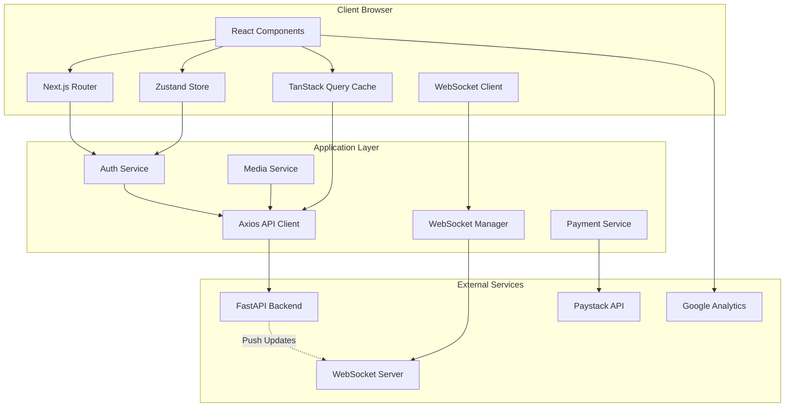

# BeatPush Frontend Design Document

## Overview

### Purpose

The BeatPush Frontend Application is a comprehensive React-based web application that provides the user interface for the BeatPush AI-powered music promotion platform. It connects to the existing FastAPI backend (https://beatspush-1.onrender.com) with 27 operational endpoints, enabling African music creators (Artists, DJs, Producers) to distribute music, automate promotion, track analytics, and monetize their work through a modern, mobile-responsive interface.

### Key Objectives

1. **User Experience**: Deliver a fast, intuitive, accessible interface optimized for music creators and fans
2. **Real-Time Communication**: Provide instant messaging with WebSocket connections for live interactions
3. **Content Management**: Enable seamless beat uploads, profile management, and campaign creation
4. **Analytics & Insights**: Visualize performance metrics through interactive dashboards
5. **Monetization**: Integrate payment processing for beat sales, tips, bookings, and subscriptions
6. **Scalability**: Support concurrent users with optimized state management and caching strategies

### Target Users

- **Artists**: Musicians and singers promoting and distributing their music
- **DJs**: Disc jockeys and radio hosts curating and sharing playlists
- **Producers**: Beat makers selling instrumental tracks and managing licensing
- **Fans**: Music listeners discovering content and supporting creators
- **Admins**: Platform administrators managing content moderation and user accounts

## Architecture

### Technology Stack


#### Core Framework
- **Next.js 14+**: React framework with App Router for SSR, SSG, and hybrid rendering
- **React 18+**: Component library with concurrent features and Suspense
- **TypeScript 5+**: Static typing for enhanced developer experience and code safety

#### Styling & UI
- **Tailwind CSS**: Utility-first CSS framework with JIT compilation
- **Shadcn UI**: Accessible component primitives built on Radix UI
- **Lucide React**: Icon library for consistent iconography
- **CSS Variables**: Theme tokens for dark/light mode support

#### State Management
- **Zustand**: Lightweight global state for authentication, UI state, and themes
- **TanStack Query (React Query)**: Server state management with automatic caching, refetching, and synchronization
- **React Hook Form**: Form state management with validation
- **Zod**: Schema validation for forms and API responses

#### Data Fetching & API
- **Axios**: HTTP client with interceptors for authentication and error handling
- **WebSocket (native)**: Real-time bidirectional communication for messaging
- **TanStack Query DevTools**: Development tools for debugging server state

#### Audio & Media
- **WaveSurfer.js**: Audio waveform visualization and playback controls
- **React Dropzone**: File upload with drag-and-drop support
- **Browser-Image-Compression**: Client-side image compression before upload


#### Routing & Navigation
- **Next.js App Router**: File-system based routing with layouts and nested routes
- **Next.js Middleware**: Authentication guards and request interception

#### Analytics & Monitoring
- **Google Analytics 4**: User behavior tracking and conversion funnels
- **Sentry (optional)**: Error tracking and performance monitoring

#### Payment Processing
- **Paystack JS**: Payment gateway integration for African markets

#### Internationalization
- **next-i18next**: Translation management for multi-language support (prepared for future)

#### Testing
- **Vitest**: Unit testing framework for TypeScript
- **React Testing Library**: Component testing with user-centric queries
- **Playwright**: End-to-end testing for critical user flows

#### Build & Development
- **Vite (via Next.js)**: Fast development server with HMR
- **ESLint**: Code linting with React and TypeScript rules
- **Prettier**: Code formatting
- **Husky**: Git hooks for pre-commit checks


### System Architecture Diagram



### Application Structure

Based on Next.js 14 App Router conventions with feature-based organization:

```
beatspush-frontend/
├── public/                      # Static assets
│   ├── images/
│   ├── fonts/
│   └── favicon.ico
├── src/
│   ├── app/                     # Next.js App Router pages
│   │   ├── (auth)/             # Auth routes group
│   │   │   ├── login/
│   │   │   ├── register/
│   │   │   └── reset-password/
│   │   ├── (dashboard)/        # Protected routes group
│   │   │   ├── profile/
│   │   │   ├── beats/
│   │   │   ├── messages/
│   │   │   ├── analytics/
│   │   │   ├── campaigns/
│   │   │   └── settings/
│   │   ├── (public)/           # Public routes
│   │   │   ├── [username]/    # Public profile
│   │   │   └── discover/
│   │   ├── admin/              # Admin routes
│   │   ├── layout.tsx          # Root layout
│   │   ├── page.tsx            # Home page
│   │   └── error.tsx           # Error boundary
│   ├── components/             # Reusable components
│   │   ├── ui/                # Shadcn UI components
│   │   ├── forms/             # Form components
│   │   ├── layouts/           # Layout components
│   │   ├── features/          # Feature-specific components
│   │   │   ├── auth/
│   │   │   ├── beats/
│   │   │   ├── messaging/
│   │   │   ├── analytics/
│   │   │   └── campaigns/
│   │   └── shared/            # Shared components
│   ├── lib/                    # Core utilities
│   │   ├── api/               # API client setup
│   │   ├── auth/              # Auth utilities
│   │   ├── websocket/         # WebSocket manager
│   │   └── utils/             # Helper functions
│   ├── hooks/                  # Custom React hooks
│   │   ├── useAuth.ts
│   │   ├── useWebSocket.ts
│   │   ├── useAudioPlayer.ts
│   │   └── useInfiniteScroll.ts
│   ├── store/                  # Zustand stores
│   │   ├── authStore.ts
│   │   ├── themeStore.ts
│   │   └── uiStore.ts
│   ├── services/               # Business logic layer
│   │   ├── authService.ts
│   │   ├── beatService.ts
│   │   ├── messageService.ts
│   │   └── paymentService.ts
│   ├── types/                  # TypeScript types
│   │   ├── api.ts
│   │   ├── models.ts
│   │   └── index.ts
│   ├── styles/                 # Global styles
│   │   └── globals.css
│   └── middleware.ts           # Next.js middleware
├── tests/                      # Test files
│   ├── unit/
│   ├── integration/
│   └── e2e/
├── .env.local                  # Environment variables
├── next.config.js              # Next.js configuration
├── tailwind.config.ts          # Tailwind configuration
├── tsconfig.json               # TypeScript configuration
└── package.json                # Dependencies
```


### Architectural Patterns

#### 1. Feature-Based Organization
Components, services, hooks, and types are organized by feature domain rather than technical layer, improving cohesion and maintainability for large-scale applications.

#### 2. Server-Client State Separation
- **Server State** (TanStack Query): API data, remote resources, cached responses
- **Client State** (Zustand): UI state, theme preferences, authentication tokens
- **Local State** (useState): Component-specific state

This separation prevents state duplication and leverages each tool's strengths.

#### 3. Layered Architecture
- **Presentation Layer**: React components and pages
- **Service Layer**: Business logic and API integration
- **Data Layer**: State management and caching
- **Infrastructure Layer**: API clients, WebSocket, utilities

#### 4. Composition Over Inheritance
React components use composition patterns with HOCs, render props, and hooks for code reuse rather than class inheritance.

#### 5. Optimistic UI Updates
For user actions like likes, follows, and favorites, the UI updates immediately while the API request processes in the background, rolling back on failure.

## Components and Interfaces

### Core Components


#### 1. Authentication Components

**LoginForm**
- Input fields: email, password
- Form validation with Zod schema
- Error display for invalid credentials
- "Remember me" checkbox
- OAuth buttons (Google, Facebook, Apple)
- Link to password reset

**RegisterForm**
- Multi-step wizard: credentials → role selection → profile info
- Email format and password strength validation
- Role selection: Artist, DJ, Producer, Fan, Admin
- AI-powered bio suggestions (optional step)
- Terms of service acceptance

**PasswordResetFlow**
- Request reset: email input
- Reset confirmation: token + new password inputs
- Success/error states with messaging

**AuthGuard (HOC)**
- Wraps protected routes
- Redirects unauthenticated users to login
- Validates JWT token expiration
- Role-based access control

#### 2. Profile Components

**ProfileHeader**
- Avatar (circular, 120px)
- Cover photo (1200x400px)
- Name, role badge, location
- Follow button with count
- Social media links
- Edit button (own profile only)

**ProfileEditor**
- Form sections: basic info, bio, social links, role-specific fields
- Image upload with preview and crop
- Character count for bio (max 500)
- Auto-save draft to localStorage

**UserCard**
- Compact profile display for lists
- Avatar, name, role, follower count
- Follow button
- Link to full profile


#### 3. Beat Marketplace Components

**BeatCard**
- Thumbnail image (300x300px)
- Title, creator name, duration
- Price with currency formatting
- Genre and tempo badges
- Play button with loading state
- Favorite button (heart icon)
- Quick add to playlist action

**BeatGrid**
- Responsive grid (1/2/3/4 columns based on viewport)
- Infinite scroll pagination
- Skeleton loading states
- Empty state with suggestions

**BeatFilters**
- Search input with debouncing (300ms)
- Genre multi-select dropdown
- Tempo range slider (60-200 BPM)
- Price range slider ($0-$500)
- Key selector (musical keys)
- Sort options (newest, popular, price)

**BeatUploadForm**
- Audio file dropzone (MP3, WAV, FLAC, max 50MB)
- Upload progress bar
- Metadata inputs: title, genre, tempo, key, price
- License type selection
- Waveform preview generator
- Tag input (comma-separated)

**BeatDetailView**
- Full waveform with playback controls
- Metadata display
- License options with pricing table
- Creator information and link
- Related beats section
- Comment section


#### 4. Audio Player Components

**AudioPlayer**
- Play/pause button
- Seek bar with progress indicator
- Volume slider
- Current time / total duration display
- Loop and shuffle controls (for playlists)
- Next/previous track buttons

**WaveformVisualizer**
- Canvas-based waveform rendering
- Real-time playback position indicator
- Clickable seek functionality
- Responsive width scaling
- Loading skeleton during generation

**PlaylistPlayer**
- Queue display with drag-to-reorder
- Auto-advance to next track
- Repeat modes (off, one, all)
- Shuffle mode

#### 5. Messaging Components

**MessageList**
- Virtualized list for performance
- Conversation items with:
  - Participant avatar and name
  - Last message preview (truncated to 50 chars)
  - Timestamp (relative: "2m ago", "yesterday")
  - Unread count badge
- Active conversation highlight

**MessageThread**
- Scrollable message history
- Message bubbles (sent vs received styling)
- Timestamps (show on hover or tap)
- Typing indicator ("User is typing...")
- Delivery status icons (sent, delivered, read)
- Auto-scroll to newest message

**MessageInput**
- Textarea with auto-resize (max 5 rows)
- Character count (max 5000)
- Send button (disabled when empty)
- Emoji picker (optional enhancement)
- File attachment button (future)


#### 6. Analytics Components

**MetricCard**
- Label (e.g., "Total Plays")
- Current value with number formatting
- Comparison badge (% change from previous period)
- Trend indicator (up/down arrow, color-coded)
- Sparkline chart (optional)

**LineChart**
- Time-series data visualization
- Responsive canvas rendering
- Hover tooltips with data points
- Multiple datasets support
- Time range selector (7d, 30d, 90d, 1y)
- Legend with toggle visibility

**BarChart**
- Horizontal or vertical bars
- Value labels on bars
- Sortable by value
- Color customization
- Hover effects

**PieChart**
- Proportional segments
- Legend with percentages
- Center label (total or selected segment)
- Interactive segment selection

**AnalyticsDashboard**
- Grid layout for metric cards
- Chart sections with titles
- Date range picker
- Export to CSV button
- Loading skeletons for async data


#### 7. Campaign Components

**CampaignForm**
- Title input
- Description textarea (rich text editor)
- Target content selector (track/beat)
- Budget input with currency
- Date range picker (start/end dates)
- Platform target checkboxes
- AI content generation button

**CampaignCard**
- Status badge (active, scheduled, completed)
- Title and description preview
- Date range display
- Budget and spend progress bar
- Key metrics preview
- Action buttons (view, edit, pause, delete)

**CampaignDetailView**
- Full campaign information
- Performance metrics dashboard
- Traffic source breakdown
- Daily performance chart
- Edit and action buttons

**AIContentGenerator**
- Content type selector (caption, press release, description)
- Track context input
- Generate button with loading state
- Generated content display (editable)
- Regenerate button
- Copy to clipboard button


#### 8. Social Feed Components

**FeedPost**
- Author information (avatar, name, role, timestamp)
- Content text (linkified, hashtag support)
- Media attachments (images/videos with gallery)
- Interaction buttons (like, comment, share)
- Counts (likes, comments, shares)
- Comment section (collapsed by default)

**PostComposer**
- Textarea with placeholder
- Character count (max 2000)
- Media upload button with preview
- Post button (disabled when empty)
- Visibility toggle (public, followers only)

**CommentSection**
- Nested comment threads (max 2 levels)
- Comment input
- Like button on comments
- Delete button (own comments only)
- Load more comments button

**ShareModal**
- Share options: copy link, share to feed, external platforms
- Platform buttons (Twitter, Facebook, WhatsApp)
- Custom message input
- Privacy selector

#### 9. Payment Components

**TipModal**
- Predefined amounts ($5, $10, $20, $50, custom)
- Custom amount input
- Payment method selector
- Message to creator (optional)
- Total with fees display
- Confirm button

**CheckoutForm**
- Paystack embed integration
- Billing information inputs
- Payment confirmation
- Success/error messaging


**PurchaseHistory**
- Table or list of transactions
- Date, item, amount, status
- Download/receipt links
- Filters (date range, status)

#### 10. Notification Components

**NotificationBell**
- Bell icon with unread count badge
- Dropdown panel on click
- List of recent notifications (max 10)
- Mark all as read button
- Link to full notification center

**NotificationItem**
- Icon based on notification type
- Message with action links
- Timestamp (relative)
- Read/unread state (background color)
- Dismiss button

**NotificationCenter**
- Full paginated list of notifications
- Filters (all, unread, mentions, etc.)
- Group by date
- Infinite scroll

#### 11. Admin Components

**AdminDashboard**
- Platform statistics cards
- Charts for trends
- Recent activity feed
- Quick action buttons

**UserManagementTable**
- Sortable columns
- Search and filters
- Action buttons (view, suspend, edit role)
- Pagination controls

**ContentModerationQueue**
- Flagged content list
- Preview with context
- Approve/reject buttons
- Bulk actions


#### 12. Shared UI Components

**Button**
- Variants: primary, secondary, outline, ghost, destructive
- Sizes: sm, md, lg
- Loading state with spinner
- Icon support (left/right)
- Disabled state

**Input**
- Label and optional helper text
- Error state with message
- Prefix/suffix icons
- Input types: text, email, password, number
- Controlled and uncontrolled modes

**Select**
- Dropdown with search
- Single and multi-select
- Custom option rendering
- Loading state
- Clear button

**Modal/Dialog**
- Overlay with backdrop
- Close button (X icon)
- Header, body, footer sections
- Size variants (sm, md, lg, fullscreen)
- Keyboard navigation (Esc to close)

**Toast/Snackbar**
- Positioned bottom-right or top-center
- Types: success, error, warning, info
- Auto-dismiss timer (default 5s)
- Action button (optional)
- Close button

**Skeleton**
- Animated shimmer effect
- Shape variants (text, circle, rectangle)
- Size and color customization


### API Integration Layer

#### API Client (Axios Instance)

```typescript
// lib/api/client.ts
import axios from 'axios';
import { authStore } from '@/store/authStore';

const apiClient = axios.create({
  baseURL: 'https://beatspush-1.onrender.com',
  timeout: 10000,
  headers: {
    'Content-Type': 'application/json',
  },
});

// Request interceptor: Add auth token
apiClient.interceptors.request.use(
  (config) => {
    const token = authStore.getState().token;
    if (token) {
      config.headers.Authorization = `Bearer ${token}`;
    }
    return config;
  },
  (error) => Promise.reject(error)
);

// Response interceptor: Handle 401 and refresh token
apiClient.interceptors.response.use(
  (response) => response,
  async (error) => {
    if (error.response?.status === 401) {
      authStore.getState().logout();
      window.location.href = '/login';
    }
    return Promise.reject(error);
  }
);

export default apiClient;
```


#### Service Layer Pattern

```typescript
// services/beatService.ts
import apiClient from '@/lib/api/client';
import { Beat, BeatFilters } from '@/types/models';

export const beatService = {
  async getBeats(filters: BeatFilters, page = 1, limit = 20) {
    const response = await apiClient.get('/beats', {
      params: { ...filters, page, limit },
    });
    return response.data;
  },

  async getBeatById(id: string) {
    const response = await apiClient.get(`/beats/${id}`);
    return response.data;
  },

  async uploadBeat(formData: FormData) {
    const response = await apiClient.post('/beats', formData, {
      headers: { 'Content-Type': 'multipart/form-data' },
      timeout: 60000, // 60s for uploads
    });
    return response.data;
  },

  async updateBeat(id: string, data: Partial<Beat>) {
    const response = await apiClient.put(`/beats/${id}`, data);
    return response.data;
  },

  async deleteBeat(id: string) {
    await apiClient.delete(`/beats/${id}`);
  },

  async favoriteBeat(id: string) {
    const response = await apiClient.post(`/beats/${id}/favorite`);
    return response.data;
  },
};
```


#### React Query Integration

```typescript
// hooks/useBeats.ts
import { useQuery, useMutation, useQueryClient } from '@tanstack/react-query';
import { beatService } from '@/services/beatService';

export function useBeats(filters: BeatFilters) {
  return useQuery({
    queryKey: ['beats', filters],
    queryFn: () => beatService.getBeats(filters),
    staleTime: 5 * 60 * 1000, // 5 minutes
  });
}

export function useBeat(id: string) {
  return useQuery({
    queryKey: ['beat', id],
    queryFn: () => beatService.getBeatById(id),
    enabled: !!id,
  });
}

export function useFavoriteBeat() {
  const queryClient = useQueryClient();

  return useMutation({
    mutationFn: beatService.favoriteBeat,
    onMutate: async (beatId) => {
      // Optimistic update
      await queryClient.cancelQueries({ queryKey: ['beat', beatId] });
      const previousBeat = queryClient.getQueryData(['beat', beatId]);

      queryClient.setQueryData(['beat', beatId], (old: any) => ({
        ...old,
        isFavorited: !old.isFavorited,
      }));

      return { previousBeat };
    },
    onError: (err, beatId, context) => {
      // Rollback on error
      queryClient.setQueryData(['beat', beatId], context?.previousBeat);
    },
    onSettled: (data, error, beatId) => {
      // Refetch to sync with server
      queryClient.invalidateQueries({ queryKey: ['beat', beatId] });
    },
  });
}
```


### WebSocket Manager

```typescript
// lib/websocket/manager.ts
import { authStore } from '@/store/authStore';

type MessageHandler = (data: any) => void;

class WebSocketManager {
  private ws: WebSocket | null = null;
  private handlers: Map<string, MessageHandler[]> = new Map();
  private reconnectAttempts = 0;
  private maxReconnectAttempts = 5;
  private reconnectDelay = 1000;

  connect() {
    const token = authStore.getState().token;
    if (!token) return;

    this.ws = new WebSocket(
      `wss://beatspush-1.onrender.com/ws?token=${token}`
    );

    this.ws.onopen = () => {
      console.log('WebSocket connected');
      this.reconnectAttempts = 0;
    };

    this.ws.onmessage = (event) => {
      const message = JSON.parse(event.data);
      const handlers = this.handlers.get(message.type) || [];
      handlers.forEach((handler) => handler(message.data));
    };

    this.ws.onerror = (error) => {
      console.error('WebSocket error:', error);
    };

    this.ws.onclose = () => {
      console.log('WebSocket closed');
      this.attemptReconnect();
    };
  }

  private attemptReconnect() {
    if (this.reconnectAttempts >= this.maxReconnectAttempts) {
      console.error('Max reconnect attempts reached');
      return;
    }

    setTimeout(() => {
      this.reconnectAttempts++;
      this.connect();
    }, this.reconnectDelay * Math.pow(2, this.reconnectAttempts));
  }

  send(type: string, data: any) {
    if (this.ws?.readyState === WebSocket.OPEN) {
      this.ws.send(JSON.stringify({ type, data }));
    }
  }

  on(type: string, handler: MessageHandler) {
    if (!this.handlers.has(type)) {
      this.handlers.set(type, []);
    }
    this.handlers.get(type)!.push(handler);
  }

  off(type: string, handler: MessageHandler) {
    const handlers = this.handlers.get(type);
    if (handlers) {
      this.handlers.set(
        type,
        handlers.filter((h) => h !== handler)
      );
    }
  }

  disconnect() {
    this.ws?.close();
    this.ws = null;
    this.handlers.clear();
  }
}

export const wsManager = new WebSocketManager();
```


## Data Models

### User Model

```typescript
// types/models.ts
export interface User {
  id: string;
  email: string;
  fullName: string;
  role: 'artist' | 'dj' | 'producer' | 'fan' | 'admin';
  avatar?: string;
  coverPhoto?: string;
  bio?: string;
  location?: string;
  socialLinks?: {
    spotify?: string;
    appleMusic?: string;
    instagram?: string;
    twitter?: string;
    facebook?: string;
    tiktok?: string;
  };
  isVerified: boolean;
  followerCount: number;
  followingCount: number;
  createdAt: string;
  updatedAt: string;
}

export interface Profile extends User {
  // Role-specific fields
  stageName?: string; // Artist/DJ/Producer
  genres?: string[]; // Artist/DJ/Producer
  recordLabel?: string; // Artist
  equipment?: string; // DJ/Producer
  availableForBooking?: boolean; // Artist/DJ
  bookingRate?: number; // Artist/DJ
}
```


### Beat Model

```typescript
export interface Beat {
  id: string;
  title: string;
  creatorId: string;
  creator: User;
  audioUrl: string;
  waveformUrl?: string;
  thumbnailUrl?: string;
  genre: string;
  tempo: number;
  key: string;
  duration: number; // in seconds
  price: number;
  licenses: LicenseOption[];
  tags: string[];
  playCount: number;
  favoriteCount: number;
  isFavorited?: boolean; // Current user context
  isPurchased?: boolean; // Current user context
  createdAt: string;
  updatedAt: string;
}

export interface LicenseOption {
  id: string;
  name: string;
  price: number;
  description: string;
  usageRights: string[];
}

export interface BeatFilters {
  search?: string;
  genre?: string[];
  tempoMin?: number;
  tempoMax?: number;
  priceMin?: number;
  priceMax?: number;
  key?: string;
  sortBy?: 'newest' | 'popular' | 'price_asc' | 'price_desc';
}
```


### Message Model

```typescript
export interface Message {
  id: string;
  conversationId: string;
  senderId: string;
  sender: User;
  content: string;
  status: 'sent' | 'delivered' | 'read';
  createdAt: string;
}

export interface Conversation {
  id: string;
  participants: User[];
  lastMessage?: Message;
  unreadCount: number;
  updatedAt: string;
}
```

### Campaign Model

```typescript
export interface Campaign {
  id: string;
  userId: string;
  title: string;
  description: string;
  targetContentId: string;
  targetContentType: 'track' | 'beat';
  budget: number;
  spent: number;
  startDate: string;
  endDate: string;
  status: 'draft' | 'scheduled' | 'active' | 'paused' | 'completed';
  metrics: {
    impressions: number;
    clicks: number;
    conversions: number;
    ctr: number;
    costPerConversion: number;
  };
  createdAt: string;
  updatedAt: string;
}
```


### Post Model

```typescript
export interface Post {
  id: string;
  authorId: string;
  author: User;
  content: string;
  mediaUrls?: string[];
  likeCount: number;
  commentCount: number;
  shareCount: number;
  isLiked?: boolean; // Current user context
  createdAt: string;
  updatedAt: string;
}

export interface Comment {
  id: string;
  postId: string;
  authorId: string;
  author: User;
  content: string;
  likeCount: number;
  isLiked?: boolean;
  createdAt: string;
}
```

### Analytics Model

```typescript
export interface AnalyticsOverview {
  totalPlays: number;
  totalLikes: number;
  totalShares: number;
  revenue: number;
  playsDelta: number; // % change from previous period
  likesDelta: number;
  sharesDelta: number;
  revenueDelta: number;
}

export interface TimeSeriesData {
  date: string;
  value: number;
}

export interface TopTrack {
  id: string;
  title: string;
  playCount: number;
}

export interface AudienceDemographic {
  location: string;
  count: number;
  percentage: number;
}
```


### Notification Model

```typescript
export interface Notification {
  id: string;
  userId: string;
  type:
    | 'follow'
    | 'like'
    | 'comment'
    | 'message'
    | 'booking'
    | 'payment'
    | 'system';
  actorId?: string; // User who triggered the notification
  actor?: User;
  targetId?: string; // Related content ID
  targetType?: 'post' | 'beat' | 'track' | 'comment';
  content: string;
  isRead: boolean;
  createdAt: string;
}
```

### State Management Models

#### Zustand Stores

```typescript
// store/authStore.ts
export interface AuthState {
  user: User | null;
  token: string | null;
  isAuthenticated: boolean;
  login: (email: string, password: string) => Promise<void>;
  logout: () => void;
  register: (data: RegisterData) => Promise<void>;
  updateProfile: (data: Partial<User>) => Promise<void>;
}

// store/themeStore.ts
export interface ThemeState {
  mode: 'light' | 'dark';
  toggleTheme: () => void;
  setTheme: (mode: 'light' | 'dark') => void;
}

// store/uiStore.ts
export interface UIState {
  isSidebarOpen: boolean;
  isModalOpen: boolean;
  modalContent: React.ReactNode | null;
  toggleSidebar: () => void;
  openModal: (content: React.ReactNode) => void;
  closeModal: () => void;
}
```


## Error Handling

### Error Types

```typescript
// types/errors.ts
export class APIError extends Error {
  constructor(
    public statusCode: number,
    public message: string,
    public errors?: Record<string, string[]>
  ) {
    super(message);
    this.name = 'APIError';
  }
}

export class ValidationError extends Error {
  constructor(public errors: Record<string, string>) {
    super('Validation failed');
    this.name = 'ValidationError';
  }
}

export class NetworkError extends Error {
  constructor(message = 'Network request failed') {
    super(message);
    this.name = 'NetworkError';
  }
}

export class AuthenticationError extends Error {
  constructor(message = 'Authentication required') {
    super(message);
    this.name = 'AuthenticationError';
  }
}
```

### Error Handling Strategy

**API Error Responses**
- Parse error response from backend
- Map status codes to user-friendly messages
- Display field-specific validation errors inline
- Show toast notifications for operation failures

**Network Failures**
- Detect offline state
- Display retry button for failed requests
- Queue actions for retry when connection restored
- Show offline indicator in UI


**React Error Boundaries**
- Catch rendering errors at component boundaries
- Display fallback UI with error message
- Provide "Try Again" button to reset error state
- Log errors to console (or Sentry in production)

**Form Validation**
- Client-side validation with Zod schemas before submission
- Display inline error messages below fields
- Highlight invalid fields with red borders
- Prevent submission until all fields valid

**Error Recovery Patterns**

```typescript
// components/ErrorBoundary.tsx
export class ErrorBoundary extends React.Component<
  { children: React.ReactNode },
  { hasError: boolean; error?: Error }
> {
  constructor(props: any) {
    super(props);
    this.state = { hasError: false };
  }

  static getDerivedStateFromError(error: Error) {
    return { hasError: true, error };
  }

  componentDidCatch(error: Error, errorInfo: React.ErrorInfo) {
    console.error('Error caught by boundary:', error, errorInfo);
  }

  render() {
    if (this.state.hasError) {
      return (
        <div className="error-fallback">
          <h2>Something went wrong</h2>
          <p>{this.state.error?.message}</p>
          <button onClick={() => this.setState({ hasError: false })}>
            Try Again
          </button>
        </div>
      );
    }

    return this.props.children;
  }
}
```


**Error Messaging Guidelines**

| Error Type | User Message Example | Recovery Action |
|------------|---------------------|-----------------|
| Network failure | "Unable to connect. Check your internet connection." | Retry button |
| 401 Unauthorized | "Your session expired. Please log in again." | Redirect to login |
| 403 Forbidden | "You don't have permission to perform this action." | Go back |
| 404 Not Found | "The content you're looking for doesn't exist." | Return to home |
| 422 Validation | "Please correct the errors below." | Show field errors |
| 500 Server Error | "Something went wrong on our end. We're fixing it." | Retry later |
| File too large | "File size must be under 50MB." | Choose smaller file |
| Invalid format | "Please upload a valid MP3, WAV, or FLAC file." | Choose correct format |

## Testing Strategy

### Unit Testing (Vitest + React Testing Library)

**Target Coverage: 70% minimum**

**Test Categories:**

1. **Utility Functions**
   - Date formatting helpers
   - Currency formatting
   - Validation helpers
   - URL builders

2. **Custom Hooks**
   - `useAuth` authentication logic
   - `useDebounce` input debouncing
   - `useInfiniteScroll` pagination
   - `useAudioPlayer` playback controls

3. **Service Layer**
   - API service functions with mocked Axios
   - Request/response transformations
   - Error handling paths


4. **Components**
   - Render tests for UI components
   - User interaction simulations (click, type, submit)
   - Conditional rendering based on props
   - Accessibility attributes (aria-labels, roles)

**Example Unit Test:**

```typescript
// tests/unit/components/BeatCard.test.tsx
import { render, screen, fireEvent } from '@testing-library/react';
import { BeatCard } from '@/components/features/beats/BeatCard';

describe('BeatCard', () => {
  const mockBeat = {
    id: '1',
    title: 'Test Beat',
    creator: { name: 'Producer X' },
    price: 50,
    duration: 180,
  };

  it('renders beat information correctly', () => {
    render(<BeatCard beat={mockBeat} />);
    expect(screen.getByText('Test Beat')).toBeInTheDocument();
    expect(screen.getByText('Producer X')).toBeInTheDocument();
    expect(screen.getByText('$50')).toBeInTheDocument();
  });

  it('calls onPlay when play button clicked', () => {
    const onPlay = vi.fn();
    render(<BeatCard beat={mockBeat} onPlay={onPlay} />);
    fireEvent.click(screen.getByRole('button', { name: /play/i }));
    expect(onPlay).toHaveBeenCalledWith('1');
  });
});
```


### Integration Testing

**Focus Areas:**

1. **Authentication Flow**
   - Register → verify email → login → redirect to dashboard
   - Login with invalid credentials → error display
   - Token refresh on API 401 response

2. **Form Submission**
   - Fill form → validate → submit → API call → success/error handling
   - Test optimistic updates and rollback on error

3. **API Error Handling**
   - Network failure scenarios
   - Server error responses
   - Validation error display

**Example Integration Test:**

```typescript
// tests/integration/auth.test.tsx
import { render, screen, waitFor } from '@testing-library/react';
import userEvent from '@testing-library/user-event';
import { QueryClient, QueryClientProvider } from '@tanstack/react-query';
import { LoginForm } from '@/components/features/auth/LoginForm';
import { authService } from '@/services/authService';

vi.mock('@/services/authService');

describe('Login Flow', () => {
  it('handles successful login', async () => {
    const mockLogin = vi.mocked(authService.login);
    mockLogin.mockResolvedValue({ token: 'abc123', user: {...} });

    const user = userEvent.setup();
    render(<LoginForm />);

    await user.type(screen.getByLabelText(/email/i), 'test@example.com');
    await user.type(screen.getByLabelText(/password/i), 'password123');
    await user.click(screen.getByRole('button', { name: /log in/i }));

    await waitFor(() => {
      expect(mockLogin).toHaveBeenCalledWith('test@example.com', 'password123');
    });
  });
});
```


### End-to-End Testing (Playwright)

**Critical User Journeys:**

1. **New User Registration**
   - Navigate to register page
   - Complete multi-step form
   - Verify confirmation page displayed

2. **Beat Purchase Flow**
   - Browse beats → filter by genre → play preview
   - Click purchase → select license → checkout
   - Verify success page and download link

3. **Real-Time Messaging**
   - Send message to another user
   - Verify message appears in thread
   - Check unread count updates

4. **Campaign Creation**
   - Navigate to campaigns → create new
   - Fill form with valid data → submit
   - Verify campaign appears in list

**Example E2E Test:**

```typescript
// tests/e2e/beat-purchase.spec.ts
import { test, expect } from '@playwright/test';

test('user can purchase a beat', async ({ page }) => {
  await page.goto('/login');
  await page.fill('[name="email"]', 'test@example.com');
  await page.fill('[name="password"]', 'password123');
  await page.click('button[type="submit"]');

  await page.goto('/beats');
  await page.click('.beat-card:first-child .play-button');
  await page.click('.beat-card:first-child .purchase-button');

  await page.click('[data-license="basic"]');
  await page.click('button:has-text("Continue to Checkout")');

  // Mock Paystack payment
  await page.route('**/paystack/**', (route) => route.fulfill({
    status: 200,
    body: JSON.stringify({ status: 'success' }),
  }));

  await expect(page.locator('.success-message')).toBeVisible();
  await expect(page.locator('.download-link')).toBeVisible();
});
```


### Performance Testing

**Metrics to Monitor:**

- **First Contentful Paint (FCP)**: < 1.8s
- **Largest Contentful Paint (LCP)**: < 2.5s
- **Time to Interactive (TTI)**: < 3.8s
- **Cumulative Layout Shift (CLS)**: < 0.1
- **First Input Delay (FID)**: < 100ms

**Optimization Strategies:**

1. **Code Splitting**: Dynamic imports for routes and heavy components
2. **Image Optimization**: Next.js Image component with lazy loading
3. **Bundle Analysis**: Regular checks with webpack-bundle-analyzer
4. **Caching**: HTTP caching headers, TanStack Query caching
5. **Compression**: Gzip/Brotli for static assets
6. **CDN**: Serve static assets from CDN

### Accessibility Testing

**WCAG 2.1 AA Compliance:**

- Keyboard navigation for all interactive elements
- Minimum contrast ratio 4.5:1 for text
- Focus indicators visible on all focusable elements
- Screen reader compatibility (ARIA labels, semantic HTML)
- Form labels associated with inputs
- Error messages announced to screen readers

**Tools:**

- axe-core for automated accessibility testing
- Manual testing with screen readers (NVDA, JAWS)
- Keyboard-only navigation testing


## Security Considerations

### Authentication Security

**Token Storage:**
- Store JWT tokens in httpOnly cookies (preferred) or sessionStorage (fallback)
- Never store tokens in localStorage (vulnerable to XSS)
- Implement token refresh mechanism before expiration
- Clear all tokens on logout

**Password Requirements:**
- Minimum 8 characters
- Client-side validation only (server validates)
- Never log or expose passwords in console/errors

### XSS Prevention

**Content Sanitization:**
- Sanitize all user-generated content before rendering
- Use DOMPurify for HTML sanitization
- Escape special characters in user input
- Validate URLs before rendering as links

**CSP Headers:**
```typescript
// next.config.js
const cspHeader = `
  default-src 'self';
  script-src 'self' 'unsafe-eval' 'unsafe-inline' https://js.paystack.co https://www.googletagmanager.com;
  style-src 'self' 'unsafe-inline';
  img-src 'self' data: https:;
  font-src 'self';
  connect-src 'self' https://beatspush-1.onrender.com wss://beatspush-1.onrender.com https://api.paystack.co;
  frame-src https://checkout.paystack.com;
`;
```


### CSRF Protection

- Use SameSite cookie attribute for tokens
- Include CSRF tokens in state-changing requests
- Verify Origin/Referer headers on backend

### Input Validation

**Client-Side Validation with Zod:**

```typescript
// lib/validation/schemas.ts
import { z } from 'zod';

export const registerSchema = z.object({
  email: z.string().email('Invalid email address'),
  password: z
    .string()
    .min(8, 'Password must be at least 8 characters')
    .regex(/[A-Z]/, 'Password must contain uppercase letter')
    .regex(/[0-9]/, 'Password must contain number'),
  fullName: z.string().min(2, 'Name must be at least 2 characters'),
  role: z.enum(['artist', 'dj', 'producer', 'fan', 'admin']),
});

export const beatUploadSchema = z.object({
  title: z.string().min(1, 'Title is required').max(100),
  genre: z.string().min(1, 'Genre is required'),
  tempo: z.number().min(60).max(200),
  key: z.string(),
  price: z.number().min(0).max(10000),
  file: z
    .instanceof(File)
    .refine((file) => file.size <= 50 * 1024 * 1024, 'File must be under 50MB')
    .refine(
      (file) => ['audio/mp3', 'audio/wav', 'audio/flac'].includes(file.type),
      'File must be MP3, WAV, or FLAC'
    ),
});
```


### Rate Limiting (Client-Side)

- Debounce search inputs (300ms)
- Throttle scroll events for infinite scroll
- Limit WebSocket message send rate
- Implement exponential backoff for retries

### Secure Data Handling

**Sensitive Data:**
- Never log authentication tokens
- Mask credit card numbers in UI
- Don't expose API keys in client code
- Use environment variables for configuration

**File Upload Security:**
- Validate file types and sizes client-side
- Generate unique filenames (server handles)
- Scan for malicious content (server-side)

## Performance Optimization

### Code Splitting

```typescript
// app/beats/page.tsx
import dynamic from 'next/dynamic';

const BeatUploadForm = dynamic(
  () => import('@/components/features/beats/BeatUploadForm'),
  { ssr: false, loading: () => <Skeleton /> }
);

const WaveformVisualizer = dynamic(
  () => import('@/components/features/audio/WaveformVisualizer'),
  { ssr: false }
);
```

### Image Optimization

```typescript
// components/BeatCard.tsx
import Image from 'next/image';

<Image
  src={beat.thumbnailUrl}
  alt={beat.title}
  width={300}
  height={300}
  loading="lazy"
  placeholder="blur"
  blurDataURL="/placeholder.jpg"
/>
```


### Caching Strategy

**TanStack Query Configuration:**

```typescript
// lib/queryClient.ts
import { QueryClient } from '@tanstack/react-query';

export const queryClient = new QueryClient({
  defaultOptions: {
    queries: {
      staleTime: 5 * 60 * 1000, // 5 minutes
      cacheTime: 10 * 60 * 1000, // 10 minutes
      retry: 2,
      refetchOnWindowFocus: false,
    },
  },
});
```

**Cache Invalidation Rules:**
- After create/update/delete mutations
- On WebSocket updates for real-time data
- Manual refresh button in UI
- Time-based for analytics (refresh every 60s)

### Bundle Size Optimization

**Strategies:**
- Tree-shaking unused exports
- Minimize third-party dependencies
- Use lightweight alternatives (date-fns over moment.js)
- Analyze bundle with `@next/bundle-analyzer`
- Target bundle size: < 200KB initial JS

### Lazy Loading

- Images outside viewport (Intersection Observer)
- Route-based code splitting (Next.js automatic)
- Component-level dynamic imports for heavy features
- Infinite scroll for long lists (virtualization)


## Deployment and Build

### Environment Variables

```bash
# .env.local
NEXT_PUBLIC_API_URL=https://beatspush-1.onrender.com
NEXT_PUBLIC_WS_URL=wss://beatspush-1.onrender.com/ws
NEXT_PUBLIC_PAYSTACK_PUBLIC_KEY=pk_test_xxxxx
NEXT_PUBLIC_GA_MEASUREMENT_ID=G-XXXXXXXXXX

# Server-side only (no NEXT_PUBLIC prefix)
API_SECRET_KEY=xxxxx
```

### Build Configuration

```javascript
// next.config.js
/** @type {import('next').NextConfig} */
const nextConfig = {
  reactStrictMode: true,
  images: {
    domains: ['beatspush-1.onrender.com', 'res.cloudinary.com'],
    formats: ['image/avif', 'image/webp'],
  },
  experimental: {
    optimizeCss: true,
  },
  webpack: (config) => {
    config.resolve.fallback = { fs: false, net: false, tls: false };
    return config;
  },
};

module.exports = nextConfig;
```

### CI/CD Pipeline (Vercel/Netlify)

**Steps:**
1. Install dependencies (`npm ci`)
2. Run linter (`npm run lint`)
3. Run type check (`npm run type-check`)
4. Run tests (`npm run test`)
5. Build production bundle (`npm run build`)
6. Deploy to hosting platform


## Monitoring and Analytics

### Error Tracking (Sentry - Optional)

```typescript
// lib/sentry.ts
import * as Sentry from '@sentry/nextjs';

Sentry.init({
  dsn: process.env.NEXT_PUBLIC_SENTRY_DSN,
  environment: process.env.NODE_ENV,
  tracesSampleRate: 0.1,
  beforeSend(event, hint) {
    // Filter sensitive data
    if (event.request) {
      delete event.request.cookies;
      delete event.request.headers;
    }
    return event;
  },
});
```

### Google Analytics

```typescript
// lib/analytics.ts
export const GA_TRACKING_ID = process.env.NEXT_PUBLIC_GA_MEASUREMENT_ID;

export const pageview = (url: string) => {
  window.gtag('config', GA_TRACKING_ID, {
    page_path: url,
  });
};

export const event = ({ action, category, label, value }: any) => {
  window.gtag('event', action, {
    event_category: category,
    event_label: label,
    value: value,
  });
};
```

**Events to Track:**
- Page views
- User registration/login
- Beat uploads
- Beat purchases
- Campaign creation
- Message sent
- Profile views


## Internationalization (i18n) - Future Enhancement

### Setup with next-i18next

```typescript
// next-i18next.config.js
module.exports = {
  i18n: {
    defaultLocale: 'en',
    locales: ['en', 'fr', 'yo', 'ig', 'ha'], // English, French, Yoruba, Igbo, Hausa
  },
};
```

### Translation Structure

```json
// public/locales/en/common.json
{
  "nav": {
    "home": "Home",
    "beats": "Beats",
    "messages": "Messages",
    "profile": "Profile"
  },
  "auth": {
    "login": "Log In",
    "register": "Sign Up",
    "email": "Email Address",
    "password": "Password"
  },
  "errors": {
    "required": "This field is required",
    "invalidEmail": "Invalid email address",
    "networkError": "Unable to connect. Check your internet connection."
  }
}
```

### Usage in Components

```typescript
import { useTranslation } from 'next-i18next';

export function LoginForm() {
  const { t } = useTranslation('common');

  return (
    <form>
      <label>{t('auth.email')}</label>
      <input type="email" placeholder={t('auth.email')} />
      <button>{t('auth.login')}</button>
    </form>
  );
}
```


## Responsive Design Breakpoints

### Tailwind CSS Breakpoints

```typescript
// tailwind.config.ts
export default {
  theme: {
    screens: {
      'xs': '320px',   // Mobile small
      'sm': '640px',   // Mobile large
      'md': '768px',   // Tablet
      'lg': '1024px',  // Desktop small
      'xl': '1280px',  // Desktop large
      '2xl': '1536px', // Desktop XL
    },
  },
};
```

### Layout Adjustments by Breakpoint

| Component | Mobile (< 768px) | Tablet (768-1024px) | Desktop (> 1024px) |
|-----------|------------------|---------------------|-------------------|
| Navigation | Hamburger menu | Hamburger menu | Full horizontal nav |
| Beat Grid | 1 column | 2 columns | 3-4 columns |
| Profile Header | Stacked | Stacked | Side-by-side |
| Analytics Cards | 1 column | 2 columns | 4 columns |
| Message List | Full width | Sidebar + thread | Sidebar + thread |
| Forms | Full width | Centered (max 600px) | Centered (max 600px) |

### Touch Optimization

- Minimum button size: 44x44px (Apple HIG)
- Increased padding for touch targets
- Swipe gestures for navigation
- Pull-to-refresh for feed
- Long press for context menus


## Theme System

### Color Palette

```css
/* styles/globals.css */
:root {
  /* Brand Colors */
  --primary-purple-start: #667eea;
  --primary-purple-end: #764ba2;
  
  /* Light Theme */
  --background: 255 255 255;
  --foreground: 17 24 39;
  --card: 249 250 251;
  --card-foreground: 17 24 39;
  --primary: 102 126 234;
  --primary-foreground: 255 255 255;
  --secondary: 243 244 246;
  --secondary-foreground: 17 24 39;
  --muted: 243 244 246;
  --muted-foreground: 107 114 128;
  --accent: 118 75 162;
  --accent-foreground: 255 255 255;
  --destructive: 239 68 68;
  --destructive-foreground: 255 255 255;
  --border: 229 231 235;
  --input: 229 231 235;
  --ring: 102 126 234;
}

.dark {
  /* Dark Theme */
  --background: 17 24 39;
  --foreground: 249 250 251;
  --card: 31 41 55;
  --card-foreground: 249 250 251;
  --primary: 102 126 234;
  --primary-foreground: 255 255 255;
  --secondary: 55 65 81;
  --secondary-foreground: 249 250 251;
  --muted: 55 65 81;
  --muted-foreground: 156 163 175;
  --accent: 118 75 162;
  --accent-foreground: 255 255 255;
  --destructive: 239 68 68;
  --destructive-foreground: 255 255 255;
  --border: 55 65 81;
  --input: 55 65 81;
  --ring: 102 126 234;
}
```


### Theme Toggle Implementation

```typescript
// store/themeStore.ts
import { create } from 'zustand';
import { persist } from 'zustand/middleware';

interface ThemeState {
  mode: 'light' | 'dark';
  toggleTheme: () => void;
  setTheme: (mode: 'light' | 'dark') => void;
}

export const useThemeStore = create<ThemeState>()(
  persist(
    (set) => ({
      mode: 'light',
      toggleTheme: () =>
        set((state) => ({
          mode: state.mode === 'light' ? 'dark' : 'light',
        })),
      setTheme: (mode) => set({ mode }),
    }),
    { name: 'theme-storage' }
  )
);

// components/ThemeProvider.tsx
'use client';
import { useEffect } from 'react';
import { useThemeStore } from '@/store/themeStore';

export function ThemeProvider({ children }: { children: React.ReactNode }) {
  const mode = useThemeStore((state) => state.mode);

  useEffect(() => {
    document.documentElement.classList.remove('light', 'dark');
    document.documentElement.classList.add(mode);
  }, [mode]);

  return <>{children}</>;
}
```


## Accessibility Implementation

### Semantic HTML Structure

```tsx
<main role="main" aria-label="Main content">
  <nav role="navigation" aria-label="Primary navigation">
    <ul>
      <li><a href="/beats">Beats</a></li>
      <li><a href="/messages">Messages</a></li>
    </ul>
  </nav>
  
  <section aria-labelledby="beats-heading">
    <h2 id="beats-heading">Featured Beats</h2>
    <div role="list">
      {/* Beat cards */}
    </div>
  </section>
</main>
```

### Keyboard Navigation

**Supported Patterns:**
- Tab: Navigate forward through focusable elements
- Shift+Tab: Navigate backward
- Enter/Space: Activate buttons and links
- Escape: Close modals and dropdowns
- Arrow keys: Navigate within lists and menus

**Focus Management:**

```typescript
// hooks/useFocusTrap.ts
export function useFocusTrap(isActive: boolean) {
  useEffect(() => {
    if (!isActive) return;

    const focusableElements = document.querySelectorAll(
      'button, [href], input, select, textarea, [tabindex]:not([tabindex="-1"])'
    );
    const firstElement = focusableElements[0] as HTMLElement;
    const lastElement = focusableElements[focusableElements.length - 1] as HTMLElement;

    function handleTabKey(e: KeyboardEvent) {
      if (e.key !== 'Tab') return;

      if (e.shiftKey && document.activeElement === firstElement) {
        e.preventDefault();
        lastElement.focus();
      } else if (!e.shiftKey && document.activeElement === lastElement) {
        e.preventDefault();
        firstElement.focus();
      }
    }

    document.addEventListener('keydown', handleTabKey);
    return () => document.removeEventListener('keydown', handleTabKey);
  }, [isActive]);
}
```


### Screen Reader Support

**ARIA Labels:**

```tsx
<button 
  aria-label="Play Test Beat by Producer X"
  aria-pressed={isPlaying}
>
  <PlayIcon aria-hidden="true" />
</button>

<input
  type="search"
  aria-label="Search beats"
  aria-describedby="search-hint"
/>
<span id="search-hint" className="sr-only">
  Search by title, artist, or genre
</span>

<div role="alert" aria-live="polite">
  {successMessage}
</div>
```

**Skip Navigation Link:**

```tsx
<a
  href="#main-content"
  className="sr-only focus:not-sr-only focus:absolute focus:top-4 focus:left-4 focus:z-50 focus:px-4 focus:py-2 focus:bg-primary focus:text-white"
>
  Skip to main content
</a>
```

### Form Accessibility

```tsx
<div>
  <label htmlFor="email" className="required">
    Email Address
  </label>
  <input
    id="email"
    type="email"
    aria-required="true"
    aria-invalid={!!errors.email}
    aria-describedby={errors.email ? 'email-error' : undefined}
  />
  {errors.email && (
    <span id="email-error" role="alert" className="error">
      {errors.email.message}
    </span>
  )}
</div>
```


## Why Property-Based Testing is Not Applicable

After evaluating the nature of this frontend application against PBT criteria, **property-based testing is not appropriate** for the following reasons:

### 1. UI Rendering and Layout
The application primarily consists of React components that render UI elements. PBT is not suitable for:
- Component rendering logic
- Layout calculations and responsive design
- Visual appearance and styling
- User interface interactions

**Alternative**: Snapshot tests and visual regression tests are more appropriate for UI components.

### 2. Side-Effect Operations
Most frontend operations involve side effects:
- API calls to backend
- WebSocket message transmission
- LocalStorage/SessionStorage operations
- DOM manipulations
- Browser navigation

**Alternative**: Integration tests with mocked services and example-based unit tests.

### 3. State Management
React state and Zustand stores manage UI state, which is:
- Event-driven (user interactions)
- Asynchronous (API responses)
- Context-dependent (authentication status, route)

**Alternative**: Unit tests for store logic with specific scenarios and integration tests for state synchronization.


### 4. External Dependencies
The application heavily relies on external services:
- Backend API (27 endpoints)
- WebSocket server for real-time messaging
- Paystack payment gateway
- Google Analytics
- Browser APIs (localStorage, WebSocket, File API)

**Alternative**: Integration tests with mocked external services to verify correct API usage.

### 5. Form Validation
While form validation involves logic, it is best tested with:
- Example-based tests for valid/invalid inputs
- Edge case tests for boundary conditions
- Integration tests for complete form submission flows

**Alternative**: Example-based unit tests with Zod schemas and React Hook Form.

### Recommended Testing Approach

Instead of PBT, this application will use:

1. **Unit Tests (Vitest + React Testing Library)**
   - Component rendering with various props
   - Custom hooks with specific inputs
   - Utility functions (date formatting, currency conversion)
   - Service layer functions with mocked Axios

2. **Integration Tests**
   - Complete user flows (login, beat purchase, message sending)
   - API error handling scenarios
   - Form submission with validation
   - State synchronization across components

3. **End-to-End Tests (Playwright)**
   - Critical user journeys through entire application
   - Real browser interactions
   - Payment flow simulation
   - WebSocket real-time features

This testing strategy provides comprehensive coverage appropriate for a React frontend application without the overhead of PBT, which is better suited for pure functional logic and algorithmic code.


## Development Workflow

### Local Development Setup

1. **Clone Repository**
   ```bash
   git clone <repository-url>
   cd beatspush-frontend
   ```

2. **Install Dependencies**
   ```bash
   npm install
   ```

3. **Configure Environment**
   ```bash
   cp .env.example .env.local
   # Edit .env.local with actual values
   ```

4. **Start Development Server**
   ```bash
   npm run dev
   # Application runs on http://localhost:3000
   ```

5. **Run Tests**
   ```bash
   npm run test           # Unit tests
   npm run test:watch     # Watch mode
   npm run test:e2e       # E2E tests
   npm run test:coverage  # Coverage report
   ```

### Git Workflow

**Branch Strategy:**
- `main`: Production-ready code
- `develop`: Integration branch for features
- `feature/*`: New features
- `bugfix/*`: Bug fixes
- `hotfix/*`: Urgent production fixes

**Commit Convention:**
```
type(scope): subject

feat(auth): add password reset flow
fix(beats): correct waveform rendering
docs(readme): update setup instructions
test(profile): add profile editor tests
```

### Code Review Checklist

- [ ] TypeScript types defined for new code
- [ ] Components have proper prop validation
- [ ] Error handling implemented
- [ ] Loading states added
- [ ] Accessibility attributes present
- [ ] Tests written and passing
- [ ] No console.log statements
- [ ] Responsive design verified
- [ ] Performance optimized (lazy loading, memoization)


## Migration and Integration Plan

### Phase 1: Foundation (Week 1-2)
- Setup Next.js project with TypeScript
- Configure Tailwind CSS and Shadcn UI
- Implement theme system (dark/light mode)
- Create basic routing structure
- Setup API client with Axios
- Implement authentication flows (login, register)

### Phase 2: Core Features (Week 3-5)
- Build profile management system
- Implement beat marketplace (browse, search, filter)
- Create audio player with waveform
- Setup WebSocket for messaging
- Implement real-time messaging UI
- Add notification system

### Phase 3: Advanced Features (Week 6-8)
- Build analytics dashboard with charts
- Implement campaign builder
- Add AI content generation integration
- Create payment flows (Paystack)
- Build fan club subscription system
- Implement booking management

### Phase 4: Enhancement (Week 9-10)
- Add social feed and posting
- Implement promo link creator
- Build admin dashboard
- Add SEO optimization
- Implement offline support
- Performance optimization

### Phase 5: Testing & Launch (Week 11-12)
- Comprehensive testing (unit, integration, E2E)
- Accessibility audit and fixes
- Performance benchmarking
- Security review
- Documentation
- Production deployment


## Technical Debt and Future Improvements

### Known Limitations

1. **Browser Compatibility**
   - WebSocket may not work in very old browsers
   - Audio playback requires modern browser APIs
   - Service Worker requires HTTPS

2. **Performance Considerations**
   - Large beat libraries may impact initial load
   - Real-time updates can strain older devices
   - Image-heavy feeds require aggressive lazy loading

3. **Feature Gaps** (Future Enhancements)
   - Voice messages in chat
   - Video content support
   - Advanced audio editing tools
   - Collaborative playlists
   - Live streaming features

### Technical Debt Items

- Migrate from REST to GraphQL for flexible data fetching
- Implement React Server Components for better SSR
- Add more comprehensive error tracking
- Improve test coverage to 90%
- Optimize bundle size further
- Add progressive web app (PWA) manifest

### Scalability Considerations

**Current Design Supports:**
- 100,000+ concurrent users (with proper caching)
- Real-time messaging for active conversations
- Infinite scroll for large datasets
- Optimistic UI updates for instant feedback

**Future Scaling Needs:**
- CDN for static assets and images
- Redis caching layer for API responses
- Load balancing for multiple frontend instances
- Database query optimization on backend
- WebSocket connection pooling


## Conclusion

This design document provides a comprehensive technical blueprint for the BeatPush Frontend Application. The architecture leverages modern React patterns with Next.js 14, TypeScript, and a carefully selected technology stack to deliver a performant, scalable, and maintainable music promotion platform.

### Key Design Decisions

1. **Next.js App Router**: Enables hybrid rendering strategies (SSR, SSG, CSR) for optimal performance
2. **State Separation**: Zustand for client state, TanStack Query for server state, maintaining clear boundaries
3. **Component Architecture**: Feature-based organization with Shadcn UI for consistent, accessible components
4. **Real-Time Communication**: Native WebSocket with reconnection logic for reliable messaging
5. **Testing Strategy**: Comprehensive unit, integration, and E2E tests appropriate for frontend applications
6. **Performance First**: Code splitting, lazy loading, and aggressive caching for fast user experience
7. **Accessibility Compliance**: WCAG 2.1 AA standards with keyboard navigation and screen reader support

### Success Metrics

**Performance:**
- Initial load < 3 seconds
- Time to Interactive < 3.8 seconds
- Lighthouse score > 90

**Quality:**
- Test coverage > 70%
- Zero critical accessibility violations
- < 5 high-severity bugs in production

**User Experience:**
- Real-time message delivery < 500ms
- Form submission response < 1 second
- Smooth 60fps animations and transitions

This design provides the foundation for building a world-class music platform that serves African creators and fans with excellence.

